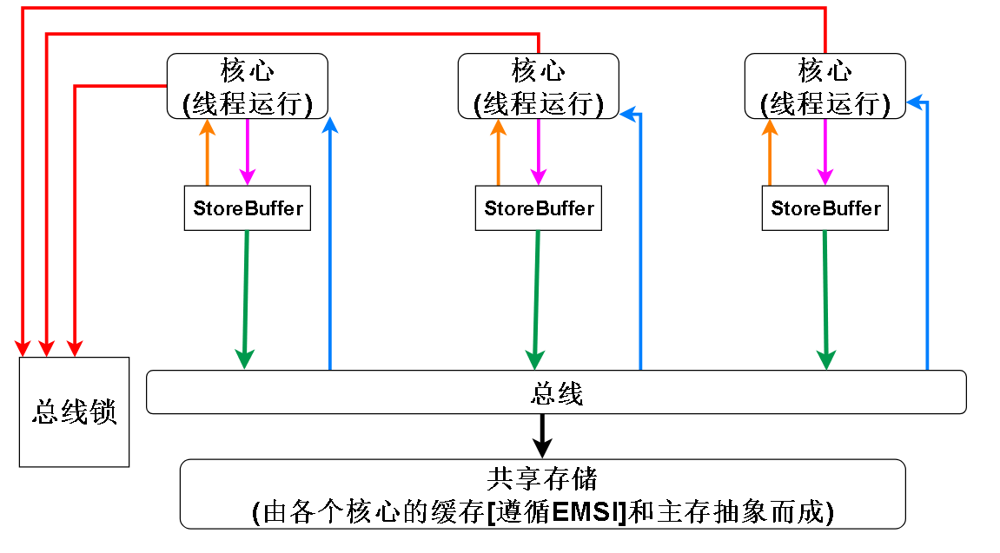

# c++原子操作与内存序

## 1. 原子操作简介
- **原子操作**：操作不可被中断，要么全部完成，要么完全不发生。
- C++11 起提供 `<atomic>` 头文件支持。
- 原子类型：
  - `std::atomic<T>`：模板，T 需满足 TriviallyCopyable。
  - 常用特化：`std::atomic<bool>`, `std::atomic<int>`, `std::atomic<char>`, `std::atomic_flag` 等。

### 基本用法
```cpp
#include <atomic>

std::atomic<int> counter{0};

void f() {
    counter.fetch_add(1, std::memory_order_relaxed);
}
```

---

## 2. 原子操作的常用方法
- load(memory_order) —— 读取值。
- store(value, memory_order) —— 写入值。
- exchange(value, memory_order) —— 交换并返回旧值。
- compare_exchange_strong/weak(expected, desired, memory_order) —— CAS。
- fetch_add, fetch_sub, fetch_and, fetch_or, fetch_xor —— 原子算术/逻辑操作。

---

## 3. 内存序（Memory Order）

### 枚举值

* `std::memory_order_relaxed`
  * 只保证原子性，不保证顺序。
* `std::memory_order_consume`（已废弃/弱化）
  * 保证依赖顺序（几乎等同于 `acquire`）。
* `std::memory_order_acquire`
  * 当前线程中，此操作**之后**的读写不会重排到此操作之前。
* `std::memory_order_release`
  * 当前线程中，此操作**之前**的读写不会重排到此操作之后。
* `std::memory_order_acq_rel`
  * 同时具有 `acquire + release` 语义。
* `std::memory_order_seq_cst`
  * 最强顺序，全局按顺序一致执行。

### 对比表

| 内存序       | 原子性 | 顺序保证    | 常见场景    |
| --------- | --- | ------- | ------- |
| `relaxed` | ✅   | ❌       | 性能敏感计数器 |
| `acquire` | ✅   | 保证后续不越过 | 加锁      |
| `release` | ✅   | 保证之前不越过 | 解锁      |
| `acq_rel` | ✅   | 双向保证    | 读-改-写操作 |
| `seq_cst` | ✅   | 全局一致    | 最强保证    |

---

## 4. 典型模式

### 4.1 自旋锁

```cpp
std::atomic_flag lock = ATOMIC_FLAG_INIT;

void lock_func() {
    while (lock.test_and_set(std::memory_order_acquire)) {}
}

void unlock_func() {
    lock.clear(std::memory_order_release);
}
```

### 4.2 双线程通信（生产-消费）

```cpp
std::atomic<bool> ready{false};
int data;

void producer() {
    data = 42;
    ready.store(true, std::memory_order_release); // 防止 data = 42 重排到该语句之后
}

void consumer() {
    while (!ready.load(std::memory_order_acquire)); // 防止读取 data 重排到该语句之前
    // 此时能看到 data = 42
    assert(data == 42);
}
```

### 4.3 多线程通信（保持全局顺序一致）

```cpp
#include <atomic>
#include <thread>
#include <iostream>

std::atomic<int> x(0), y(0);
int r1, r2, r3, r4;

void thread1() {
  // 使用 memory_order_seq_cst 会锁总线，立即刷新缓冲区，让 x 能够立即通知到所有 cpu
  x.store(1, std::memory_order_seq_cst); // (1)
}

void thread2() {
  y.store(1, std::memory_order_seq_cst); // (2)
}

void thread3() {
  r1 = x.load(std::memory_order_seq_cst); // (3)
  r2 = y.load(std::memory_order_seq_cst); // (4)
}

void thread4() {
  r3 = y.load(std::memory_order_seq_cst); // (5)
  r4 = x.load(std::memory_order_seq_cst); // (6)
}

int main() {
  std::thread t1(thread1);
  std::thread t2(thread2);
  std::thread t3(thread3);
  std::thread t4(thread4);
  t1.join(); t2.join(); t3.join(); t4.join();

  // 在 seq_cst 下，不可能出现以下场景
  assert(!(r1 == 1 && r2 == 0 && r3 == 1 && r4 == 0));
  return 0;
}
```

---

## 5. 常见误区

1. **`relaxed` 不保证顺序**：仅保证原子性，线程间可能观察到乱序。
2. **不要过度使用 `seq_cst`**：性能开销大，除非确实需要全局有序。
3. **CAS 循环要注意 weak/strong**：
   * `compare_exchange_weak` 可能因伪失败返回 false，适合循环。
   * `compare_exchange_strong` 没有伪失败，但可能更慢。

---

## 6. 内存模型与 CPU 对应

* x86 架构：天然保证 **LoadLoad / StoreStore / LoadStore** 顺序，主要需要 `mfence` 保证 StoreLoad。
* ARM/POWER：更弱，需要显式内存序保证。

### x86 架构下强内存模型

1. x86 是**强内存序模型（Total Store Order，TSO）**，由 CPU 的硬件组件（如乱序执行引擎、加载队列、存储缓冲区、重排缓冲区等）协同实现
2. x86 强内存模型的特点：
    1. 在硬件上必然是有 Store Buffer 存在
    2. 缓存方面因为 MESI 协议，各个 CPU 的缓存之间不存在不一致问题，所以缓存和主存可以抽象为一个共享的内存
    3. 总线锁，x86 提供了 lock 前缀 ，lock 前缀可以修饰一些指令来达到 read-modify-write 原子性的效果，比如最常见的 read-modify-write 指令 ADD，CPU 需要从内存中取出变量，加一后再写回内存，lock 前缀可以让当前 CPU 锁住总线，让其他 CPU 无法访问内存，从而保证要修改的变量不会在修改中途被其他 CPU 访问，从而达到原子性 ADD 的效果。在 x86 中还有其他的指令自带 lock 前缀的效果，比如 XCHG 指令。带锁缓存行的指令在锁释放的时候会把 Store Buffer 刷入共享存储
3. 根据上述特点可以绘制以下模型：
    

### x86 强内存模型常见问题

### 1) **如何禁止 Load→Load（LoadLoad 重排）**

* x86 的 **Load Queue** 按程序顺序发射 load 指令，后发射的 load 不会越过先发射的 load。
* 因此在硬件层面就保证了 **Load→Load 顺序性**，即不会发生 LoadLoad 乱序。

---

### 2) **如何禁止 Load→Store（LoadStore 重排）**

* **Store Buffer** 只接受按程序顺序进入的 store 指令。
* 当执行 load 时，硬件会先检查 Store Buffer 是否有同地址的未完成写（**store-to-load forwarding**）。
* 内存序检查逻辑保证：
  * store 数据按程序顺序进入 Store Buffer；
  * load 指令不会乱序到前面的 store 指令之前。
    → 因此 **Load→Store 也不会乱序**。

---

### 3) **为什么允许 Store→Load 重排，但禁止 Load→Load**

* x86 为提高性能，引入 Store Buffer，允许 store 数据提前进入缓冲，而后续的 load 指令可以绕过它执行。
* 这是 **TSO 模型** 下唯一允许的乱序：**Store→Load**。
* 其他乱序（如 Load→Load）会破坏 TSO 语义，因此被禁止。

---

### 4) **写入 Store Buffer 是否向其他 CPU 发送 RFO 通知？**

* **发送 RFO**：数据写入 Store Buffer 这个动作，通常是因为核心没有独占权而触发了 RFO 请求。它们是配对发生的。
* **异步操作**：Store Buffer 的关键作用是让核心不必同步等待 RFO 完成。核心把写入任务“委托”给 Store Buffer 后就可以继续工作，从而隐藏了 RFO 延迟，大大提升了效率。
* **内存排序**：Store Buffer 的存在也是导致内存可见性问题（Memory Ordering）的根源之一。因为写入操作可能在一段时间内“滞留”在 Store Buffer 中，对其他核心不可见。x86 架构通常是强内存模型（TSO, Total Store Order），但它仍然需要像 MFENCE 这样的内存屏障指令来确保写入能及时刷新并全局可见。
* **写入合并**：Store Buffer 还可以将多个对同一缓存行的连续写入合并起来，最后只执行一次 RFO，进一步减少总线流量。

---

### 5) **多个 CPU 同时写同一数据，如何保证全局顺序？**

* 缓存一致性协议（MESI/MOESI）保证：同一缓存行在全局只允许一个 CPU 拥有写权限。
* 多个 CPU 同时写时，**谁先获得写权限**，其写就先生效，形成全局顺序。
* 使用 **锁/原子指令/内存屏障** 时，会强制序列化并清空相关 Store Buffer，确保写的原子性与可见性。

---

### 6) **Store Buffer 何时刷入 Cache/对外可见？**

常见触发条件：

1. **程序顺序需要**：保证写按顺序对外可见；
2. **获得写权限**：发起 RFO 后写入 L1；
3. **Store Buffer 空间不足**：迫使刷出；
4. **Fence/原子指令/I/O 访问**：强制 drain；
5. **一致性交互**：其他核的读/写请求触发冲刷；
6. **缓存驱逐**：行被替换时写回；
7. **设备访问或内存模型约束**：需要立即可见时。

---

## 7. 总结

* 使用 `std::atomic` 替代手写锁可以提升性能，但必须理解内存序。
* 一般推荐使用：
  * **`relaxed`**：性能计数器
  * **`acquire/release`**：同步、锁实现
  * **`seq_cst`**：安全但保守

---

## 8. 常见面试题

### 一、基础概念

**Q1. 什么是原子操作？**

* 不可分割的操作，线程安全，不会被中断。
* C++11 提供 `std::atomic`。

**Q2. `volatile` vs `std::atomic`？**

* `volatile`：只保证编译器不优化访问，不保证线程安全。
* `atomic`：保证原子性和内存可见性。

**Q3. 为什么需要内存序？**

* 为了控制编译器和 CPU 的指令重排，保证多线程间数据可见性。

**Q4. 常见的 `memory_order`？**

* `relaxed`：仅保证原子性。
* `acquire`：防止之后的操作被重排到前面。
* `release`：防止之前的操作被重排到后面。
* `acq_rel`：双向。
* `seq_cst`：全局顺序一致。

**Q5. 为什么 `consume` 基本不用？**

* 规范模糊，几乎等同 `acquire`。

**Q6. `atomic<bool>` vs `atomic_flag`？**

* `atomic_flag` 最简单，只有 `test_and_set` / `clear`，常用于自旋锁。
* `atomic<bool>` 功能更全。

**Q7. `compare_exchange_weak` vs `compare_exchange_strong`？**

* `weak` 可能伪失败（即值没变也返回 false），适合循环重试。
* `strong` 无伪失败，可能更慢。

---

### 二、实践场景

**Q1. 如何用原子实现自旋锁？**

* 用 `atomic_flag`：

  * `test_and_set(memory_order_acquire)` 进入锁。
  * `clear(memory_order_release)` 释放锁。

**Q2. 生产者-消费者为什么用 `release/acquire`？**

* 保证数据写入在 `store` 之前完成，读取在 `load` 之后看到最新值。

**Q3. 什么时候用 `relaxed`？**

* 计数器、统计类变量，不要求顺序。

**Q4. 线程安全计数器用哪种内存序？**

* `fetch_add(1, memory_order_relaxed)` 足够。

**Q5. 为什么过度用 `seq_cst` 不好？**

* 全局强序 → 性能下降。

**Q6. 为什么无锁结构常用 CAS？**

* CAS 可以在竞争下无锁更新数据，是 lock-free 的基础原语。

---

### 三、深入原理

**Q1. 为什么 x86 不会 LoadLoad 重排？**

* x86 内存模型较强，硬件保证 LoadLoad、LoadStore、StoreStore 不乱序，只可能 StoreLoad 乱序。

**Q2. StoreLoad 为什么危险？**

* 写完后可能读到旧值（写→读被乱序），需要 fence 或 acquire/release。

**Q3. 什么是 happens-before？**

* 保证前一个操作的结果对后一个操作可见。
* 例如 `release` + `acquire` 建立 happens-before 关系。

**Q4. x86 下 `relaxed` 常“看似安全”，ARM 下却可能错？**

* ARM/POWER 更弱，可能 LoadLoad、StoreStore 也重排。

**Q5. `atomic_thread_fence` vs `atomic_signal_fence`？**

* `thread_fence`：约束 CPU 和编译器重排。
* `signal_fence`：只约束编译器重排，主要用于与硬件交互。

---

### 四、代码分析

**Q1. `counter++` 是否安全？**

```cpp
std::atomic<int> counter{0};
counter++;
```

* 安全，等价于 `fetch_add(1, memory_order_seq_cst)`。

**Q2. 下面消费者能否读到 42？**

```cpp
int data = 0;
std::atomic<bool> ready{false};

void producer() {
    data = 42;
    ready.store(true, std::memory_order_relaxed);
}
void consumer() {
    while (!ready.load(std::memory_order_relaxed));
    printf("%d\n", data);
}
```

* **不能保证**，可能读到旧值，因为 `relaxed` 不保证顺序。

**Q3. 单例模式（原子版）**

```cpp
std::atomic<MySingleton*> instance{nullptr};
std::mutex mtx;

MySingleton* get_instance() {
    MySingleton* tmp = instance.load(std::memory_order_acquire);
    if (!tmp) {
        std::lock_guard<std::mutex> lg(mtx);
        tmp = instance.load(std::memory_order_relaxed);
        if (!tmp) {
            tmp = new MySingleton();
            instance.store(tmp, std::memory_order_release);
        }
    }
    return tmp;
}
```

---

### 五、开放性问题

**Q1. 工程中如何选内存序？**

* 默认 `seq_cst` → 正确性优先。
* 高性能下，数据同步用 `release/acquire`，统计用 `relaxed`。

**Q2. 为什么说 99% 用 `acquire/release` + `seq_cst fence` 足够？**

* 能覆盖大多数同步需求，简单易懂，避免细粒度优化带来的 bug。

**Q3. C++20 `atomic_ref` 有什么用？**

* 给现有普通对象加上原子访问能力（引用包装），无需改类型定义。


## 9. 引用
- [请问memory_order_acq_rel和memory_order_seq_cst究竟有什么区别?](https://www.zhihu.com/question/561700714)
- [memory_order_seq_cst和memory_order_acq_rel有什么不同？](https://cloud.tencent.com/developer/ask/sof/104307173)
- [深入剖析缓存一致性协议(MESI),内存屏障](https://blog.csdn.net/weixin_46215617/article/details/115433851)
- [TSO于X86内存模型](https://www.cnblogs.com/icwangpu/p/18160699)
