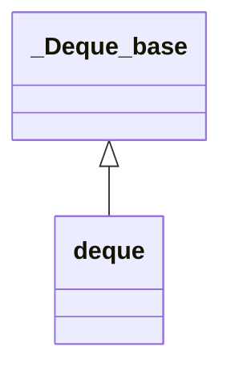

# deque 源码解析

> 当前文档为 SGI 的 deque 容器的阅读笔记

## 相关头文件

- deque
- deque.h
- stl_deque.h

## 类结构

- deque 派生于 _Deque_base
- _Deque_base 主要用于存储管理和存储接口
- deque 包含各种操作接口

### 类关系图



---

## 存储管理

> 存储管理主要在基类 _Deque_base 中实现，下列是使用 SGI 简单分配器的实现源码

### 前置协助函数

```cpp
// 计算 512 字节能放多少个 __size 大小的元素；如果超过了，则返回 1
inline size_t __deque_buf_size(size_t __size) {
  return __size < 512 ? size_t(512 / __size) : size_t(1);
}
``` 

### 基类 SGI 版本源码解析

```c++
template <class _Tp, class _Alloc>
class _Deque_base {
public:
  typedef _Deque_iterator<_Tp,_Tp&,_Tp*>             iterator; // deque 迭代器
  typedef _Deque_iterator<_Tp,const _Tp&,const _Tp*> const_iterator;

  typedef _Alloc allocator_type;
  allocator_type get_allocator() const { return allocator_type(); }

  _Deque_base(const allocator_type&, size_t __num_elements)
    : _M_map(0), _M_map_size(0),  _M_start(), _M_finish() {
    _M_initialize_map(__num_elements); // 初始化 map 空间
  }
  _Deque_base(const allocator_type&)
    : _M_map(0), _M_map_size(0),  _M_start(), _M_finish() {}
  ~_Deque_base();    

protected:
  void _M_initialize_map(size_t);
  void _M_create_nodes(_Tp** __nstart, _Tp** __nfinish);
  void _M_destroy_nodes(_Tp** __nstart, _Tp** __nfinish);
  enum { _S_initial_map_size = 8 };

protected:
  _Tp** _M_map; // 节点数组
  size_t _M_map_size;  // 表示总节点数量，一定大于有效节点数量
  iterator _M_start; // 起始迭代器
  iterator _M_finish; // 结束迭代器

  typedef simple_alloc<_Tp, _Alloc>  _Node_alloc_type;
  typedef simple_alloc<_Tp*, _Alloc> _Map_alloc_type;

  _Tp* _M_allocate_node()
    { return _Node_alloc_type::allocate(__deque_buf_size(sizeof(_Tp))); }
  void _M_deallocate_node(_Tp* __p)
    { _Node_alloc_type::deallocate(__p, __deque_buf_size(sizeof(_Tp))); }
  _Tp** _M_allocate_map(size_t __n) 
    { return _Map_alloc_type::allocate(__n); }
  void _M_deallocate_map(_Tp** __p, size_t __n) 
    { _Map_alloc_type::deallocate(__p, __n); }
};

template <class _Tp, class _Alloc>
_Deque_base<_Tp,_Alloc>::~_Deque_base() {
  if (_M_map) {
    _M_destroy_nodes(_M_start._M_node, _M_finish._M_node + 1); // 消除所有数据节点
    _M_deallocate_map(_M_map, _M_map_size); // 释放 map 内存空间资源
  }
}

template <class _Tp, class _Alloc>
void
_Deque_base<_Tp,_Alloc>::_M_initialize_map(size_t __num_elements)
{
  size_t __num_nodes = 
    __num_elements / __deque_buf_size(sizeof(_Tp)) + 1; // 计算最多需要多少个节点，每个节点 512 字节
  // 每个节点均为元素数组

  // _M_map_size 表示节点数量，一定大于 __num_nodes
  _M_map_size = max((size_t) _S_initial_map_size, __num_nodes + 2); // 与默认 map 大小取最大值
  // _M_map 表示节点数组
  _M_map = _M_allocate_map(_M_map_size);

  // __nstart 表示把前面的空间空余出来，表示有效数据的开始
  _Tp** __nstart = _M_map + (_M_map_size - __num_nodes) / 2;
  // __nfinish 表示有效数据的结尾，也是实际数组的结尾
  _Tp** __nfinish = __nstart + __num_nodes;
    
  __STL_TRY {
    _M_create_nodes(__nstart, __nfinish); // 创建节点
  }
  __STL_UNWIND((_M_deallocate_map(_M_map, _M_map_size), 
                _M_map = 0, _M_map_size = 0));
  _M_start._M_set_node(__nstart); // 开始节点
  _M_finish._M_set_node(__nfinish - 1); // 最后一个节点
  _M_start._M_cur = _M_start._M_first; // 表示第一个元素的位置
  _M_finish._M_cur = _M_finish._M_first + __num_elements % __deque_buf_size(sizeof(_Tp)); // 表示最后一个元素的下一个位置
}

template <class _Tp, class _Alloc>
void _Deque_base<_Tp,_Alloc>::_M_create_nodes(_Tp** __nstart, _Tp** __nfinish)
{
  _Tp** __cur;
  __STL_TRY {
    for (__cur = __nstart; __cur < __nfinish; ++__cur)
      *__cur = _M_allocate_node(); // 分配节点，每个节点是一个元素数组
  }
  __STL_UNWIND(_M_destroy_nodes(__nstart, __cur));
}
```

### 成员解析

|关键成员变量|作用|
|:--:|:--:|
|_M_map|节点数组，每个节点是一个元素数组指针|
|_M_map_size|表示总节点数量，一定大于有效节点数量|
|_M_start|起始迭代器|
|_M_finish|结束迭代器|

|关键成员函数|作用|
|:--:|:--:|
|_M_allocate_node|分配节点内存|
|_M_deallocate_node|释放节点内存|
|_M_allocate_map|分配节点数组内存|
|_M_deallocate_map|释放节点数组内存|
|_M_initialize_map|初始化节点数组|
|_M_create_nodes|初始化节点数组|
|_M_destroy_nodes|销毁节点数组|

---

## 关键操作实现

### deque 声明

```cpp
template <class _Tp, class _Alloc = __STL_DEFAULT_ALLOCATOR(_Tp) >
class deque : protected _Deque_base<_Tp, _Alloc>; // 保护继承，基类中的 public 方法降级为 protected
```

### push_back 源码解析

> 作用：在结尾追加元素
> 时间复杂度：有空间时为 O(1)；扩容时为 O(n)
> 迭代器失效：扩容时会造成迭代器失效

```c++
// 将 __x 追加至容器尾部
void push_back(const _Tp& __x) {
  if (_M_finish._M_cur != _M_finish._M_last - 1) { // 还有多余一个元素的空间
    construct(_M_finish._M_cur, __t); // 在 _M_finish._M_cur 位置调用构造函数
    ++_M_finish._M_cur;
  }
  else // 结尾只剩一个元素位置，并且没有额外空间
    _M_push_back_aux(__t); // 扩容追加
}

// 需要新增节点
template <class _Tp, class _Alloc>
void deque<_Tp,_Alloc>::_M_push_back_aux(const value_type& __t)
{
  value_type __t_copy = __t;
  _M_reserve_map_at_back(); // 扩容
  *(_M_finish._M_node + 1) = _M_allocate_node(); // 新分配一个节点内存（元素数组内存）
  __STL_TRY {
    construct(_M_finish._M_cur, __t_copy); // 在 _M_finish._M_cur 位置调用构造函数
    _M_finish._M_set_node(_M_finish._M_node + 1); // 结尾位置向后移一个节点
    _M_finish._M_cur = _M_finish._M_first; // 设置结尾元素位置
  }
  __STL_UNWIND(_M_deallocate_node(*(_M_finish._M_node + 1)));
}
```

### push_front 源码解析

> 作用：在开头追加元素
> 时间复杂度：有空间时为 O(1)；扩容时为 O(n)
> 迭代器失效：扩容时会造成迭代器失效

```c++
// 将 __x 追加至容器开头
void push_front(const value_type& __t) {
  if (_M_start._M_cur != _M_start._M_first) { // 如果开头有空间
    construct(_M_start._M_cur - 1, __t);
    --_M_start._M_cur;
  }
  else
    _M_push_front_aux(__t); // 扩容追加数据
}

template <class _Tp, class _Alloc>
void  deque<_Tp,_Alloc>::_M_push_front_aux(const value_type& __t)
{
  value_type __t_copy = __t;
  _M_reserve_map_at_front(); // 在开头进行扩容
  *(_M_start._M_node - 1) = _M_allocate_node(); // 分配节点内存（元素数组内存）
  __STL_TRY {
    _M_start._M_set_node(_M_start._M_node - 1); // 设置起始节点
    _M_start._M_cur = _M_start._M_last - 1; // 更新起始位置
    construct(_M_start._M_cur, __t_copy); // 在 _M_start._M_cur 位置调用构造函数
  }
  __STL_UNWIND((++_M_start, _M_deallocate_node(*(_M_start._M_node - 1))));
} 
```

### insert 源码解析

```c++
iterator insert(iterator position, const value_type& __x) {
  if (position._M_cur == _M_start._M_cur) { // 如果插入的是最前端
    push_front(__x); // 会更新 _M_start 迭代器
    return _M_start;
  }
  else if (position._M_cur == _M_finish._M_cur) { // 如果插入的是最后端
    push_back(__x); // 会更新 _M_finish 迭代器
    iterator __tmp = _M_finish;
    --__tmp;
    return __tmp; // 返回最后一个元素迭代器
  }
  else {
    return _M_insert_aux(position, __x); // 中间位置插入
  }
}

template <class _Tp, class _Alloc>
typename deque<_Tp, _Alloc>::iterator
deque<_Tp,_Alloc>::_M_insert_aux(iterator __pos, const value_type& __x)
{
  difference_type __index = __pos - _M_start;
  value_type __x_copy = __x;
  if (size_type(__index) < this->size() / 2) { // 若 pos 之前数据较少，则移动前面的数据
    push_front(front()); // 在最前面增加一个元素的位置
    iterator __front1 = _M_start;
    ++__front1;
    iterator __front2 = __front1;
    ++__front2;
    __pos = _M_start + __index;
    iterator __pos1 = __pos;
    ++__pos1;
    copy(__front2, __pos1, __front1); // 将 pos 以及 pos 之前的数据先前移动一个元素单位
  }
  else { // 移动后面的数据
    push_back(back()); // 在结尾新增一个元素的位置
    iterator __back1 = _M_finish;
    --__back1;
    iterator __back2 = __back1;
    --__back2;
    __pos = _M_start + __index;
    copy_backward(__pos, __back2, __back1); // 将 pos 以及 pos 之后的数据向后移动一个单位
  }
  *__pos = __x_copy; // 在 pos 位置拷贝目标元素
  return __pos;
}
```

---

## 扩容机制
1. 插入一个数据时，容量不够时，通常扩容一个节点（元素数组）

---

## 迭代器失效规则
1. 如果触发了扩容，部分或全部迭代器会发生失效
2. 如果未发生扩容，begin 与 end 迭代器可能会发生变化

---

## 常见面试题

### 1. 什么是 `std::deque`？它与 `std::vector` 的主要区别是什么？

**答案：**

`std::deque`（双端队列）是 C++ 标准模板库（STL）中的一个序列容器，支持在头部和尾部进行高效地插入和删除操作。

**与 `std::vector` 的主要区别：**

| 特性 | `std::vector` | `std::deque` |
| :--- | :--- | :--- |
| **内部结构** | 单一的、动态分配的数组 | **分段的、大小固定的数组**（通常是指针数组指向多个块） |
| **随机访问** | 非常快，常数时间 `O(1)` | 较快，也是常数时间 `O(1)`，但比 `vector` 稍慢（可能需要一次额外的指针解引用） |
| **头部插入/删除** | 很慢，线性时间 `O(n)`（需要移动所有后续元素） | **非常快，摊销常数时间 `O(1)`** |
| **尾部插入/删除** | 很快，摊销常数时间 `O(1)` | 非常快，摊销常数时间 `O(1)` |
| **迭代器失效** | 插入/删除可能导致所有迭代器、指针、引用失效 | **更复杂。在中间插入/删除会使所有迭代器、指针、引用失效。在头尾操作通常只会使部分迭代器失效，不会使指针和引用失效（除非指向被删除的元素）** |
| **内存使用** | 通常更少，只有一个连续的数组（但可能有容量浪费） | 更多，需要维护多个内存块和中央映射结构（指针数组） |
| **数据存储** | **总是连续的** | **是分段连续的，逻辑上连续，物理上不连续** |

**核心思想：** `vector` 是一整块大内存，而 `deque` 是由很多个小内存块组成的“超级数组”，通过一个中控器（指针数组）来管理这些块。

### 2. `std::deque` 的内部实现原理是什么？

**答案：**

典型的 `std::deque` 实现使用一种名为 **“分块数组”** 或 **“映射结构”** 的混合方法。

1.  **中控器 (Map)**：一个动态分配的指针数组（或 `vector` of pointers），其中的每个指针指向一个固定大小的内存块。
2.  **内存块 (Chunks)**：每个内存块是一个固定大小的数组，足以容纳多个元素。块的大小是实现定义的，通常是 512 字节或 1024 字节所能容纳的元素个数。
3.  **逻辑结构**：
    *   当在头部插入元素而第一个内存块已满时，`deque` 会在中控器的前面分配一个新的内存块，并将指针存入中控器。
    *   同样，在尾部插入时，如果最后的内存块已满，会在中控器后面分配新的内存块。
    *   中控器本身也是动态的。如果中控器满了，它会重新分配到一个更大的数组，并复制原有的指针。

**这种设计带来的好处：**
*   **高效的端部操作**：在头尾插入/删除只需要在对应的内存块上操作，如果块已满或空，只需分配或释放一个块，成本是常数时间。
*   **高效的随机访问**：通过计算 `index`，可以快速定位到目标元素在哪个内存块以及在该块内的偏移量。
    `元素位置 = 中控器[index / chunk_size] + index % chunk_size`

### 3. 什么情况下应该使用 `deque` 而不是 `vector` 或 `list`？

**答案：**

选择容器的黄金法则是：**根据你的主要操作需求来决定**。

*   **优先使用 `deque` 的情况：**
    *   你需要一个 **“先进先出”（FIFO）或“后进先出”（LIFO）的队列**。这是 `deque` 的经典用例。
    *   你**需要频繁地在序列的头部和尾部进行插入和删除操作**。`vector` 的头部操作成本极高，而 `list` 的总体内存开销和访问速度不如 `deque`。
    *   你需要随机访问，但又无法承受 `vector` 在中间插入时可能发生的巨大复制开销，并且你的操作恰好集中在两端。

*   **优先使用 `vector` 的情况：**
    *   你需要**频繁的随机访问**，并且大多数插入删除发生在**尾部**。
    *   你需要**内存连续性**（例如，与需要连续内存的 C API 交互）。
    *   你非常关心**存储效率**（`vector` 的内存开销通常最低）。

*   **优先使用 `list`（或 `forward_list`）的情况：**
    *   你需要**频繁地在容器的任意位置进行插入和删除**（而不仅仅是两端）。
    *   你**需要保证迭代器、指针、引用的长期有效性**，即使在插入和删除之后（只要元素本身没被删除）。
    *   你不介意**更慢的随机访问**（`O(n)`）和**更高的内存开销**（每个元素都需要额外的指针开销）。

**简单总结：**
*   **默认首选 `vector`**。
*   **需要高效的头部操作 -> 选择 `deque`**。
*   **需要任意位置的高效插入且不关心随机访问 -> 选择 `list`**。

### 4. 为什么 `deque` 的随机访问速度比 `vector` 慢？

**答案：**

虽然两者都是 `O(1)` 的时间复杂度，但常量因子不同。

1.  **额外的间接寻址**：访问 `vector` 的元素通常只需要一次指针解引用（`my_vector.data() + index`）。而访问 `deque` 的元素需要至少两次解引用：首先找到中控器，从中找到对应的内存块指针，然后在该内存块中找到元素。这增加了指令数和内存访问次数。
2.  **更差的局部性**：`vector` 的元素在内存中是连续存储的，访问相邻元素时具有极好的缓存局部性（Cache Locality），很可能一次就加载一整块数据到缓存中。而 `deque` 的各个内存块是分散分配的，访问相邻元素如果跨越了块边界，可能会导致缓存失效（Cache Miss），需要从主存中重新加载数据。

因此，在需要大量、密集的随机访问场景下，`vector` 的性能优势非常明显。

### 5. `deque` 的迭代器、指针和引用在插入/删除操作时何时会失效？

**答案：**

这是一个非常重要且容易混淆的点。

*   **在头部或尾部插入 (push_front, push_back, emplace_front, emplace_back)**：
    *   **迭代器**：**可能会失效**。如果插入导致分配了新的内存块，或者导致中控器重新分配，**所有迭代器都会失效**。但如果没有发生这些重新分配，迭代器通常保持有效。
    *   **指针和引用**：**永远不会失效**（除非指向被删除的元素）。这是 `deque` 的一个关键优势！标准明确保证了在端部插入不会使指向现有元素的指针和引用失效。

*   **在头部或尾部删除 (pop_front, pop_back)**：
    *   **迭代器**：通常，指向被删除元素的迭代器会失效。其他迭代器的有效性规则与插入类似（如果导致内存块被释放，可能会失效更多）。
    *   **指针和引用**：**只有指向被删除元素的指针和引用会失效**。指向其他元素的保持有效。

*   **在中间插入或删除 (insert, erase)**：
    *   **所有迭代器、指针和引用都会失效**。因为中间操作需要移动元素，这可能会在任何内存块中发生，破坏所有现有的指向关系。这个操作的成本是 `O(n)`，与 `vector` 类似。

**关键结论：** `deque` 为**端部操作**提供了比 `vector` 更强的指针和引用安全性保证。

### 6. 编写代码：如何使用 `deque` 实现一个简单的队列 (Queue)？

**答案：**

虽然 `std::queue` 默认就是用 `std::deque` 作为底层容器实现的，但面试官可能想看你是否理解其关系。

```cpp
#include <iostream>
#include <deque>

template<typename T>
class MyQueue {
private:
    std::deque<T> data; // 使用 deque 作为底层容器

public:
    // 入队：从尾部插入
    void enqueue(const T& value) {
        data.push_back(value);
    }

    // 出队：从头部删除
    void dequeue() {
        if (!empty()) {
            data.pop_front();
        } else {
            throw std::runtime_error("Queue is empty!");
        }
    }

    // 获取队首元素
    T& front() {
        if (!empty()) {
            return data.front();
        }
        throw std::runtime_error("Queue is empty!");
    }

    // 获取队尾元素
    T& back() {
        if (!empty()) {
            return data.back();
        }
        throw std::runtime_error("Queue is empty!");
    }

    // 检查是否为空
    bool empty() const {
        return data.empty();
    }

    // 获取队列大小
    size_t size() const {
        return data.size();
    }
};

int main() {
    MyQueue<int> q;
    q.enqueue(1);
    q.enqueue(2);
    q.enqueue(3);

    std::cout << "Front: " << q.front() << std::endl; // 1
    std::cout << "Back: " << q.back() << std::endl;   // 3

    q.dequeue();
    std::cout << "Front after dequeue: " << q.front() << std::endl; // 2

    return 0;
}
```

**为什么用 `deque` 而不用 `vector` 实现队列？**
因为 `vector` 的 `pop_front()` 操作是 `O(n)`，效率极低，而 `deque` 的 `pop_front()` 是 `O(1)`。

### 总结

| 问题焦点 | 核心答案要点 |
| :--- | :--- |
| **本质与区别** | 分段数组 vs 单一数组。核心优势：高效的端部操作。 |
| **底层原理** | 中控器 (Map) + 固定大小内存块 (Chunks)。 |
| **使用场景** | FIFO/LIFO队列，频繁的头尾操作。 |
| **性能** | 随机访问稍慢于 `vector`（间接寻址+缓存局部性差）。 |
| **迭代器失效** | **端部操作不使指针/引用失效**；中间操作使全部失效。 |
| **应用** | 是实现 `queue` 和 `stack` 的理想底层容器。 |
