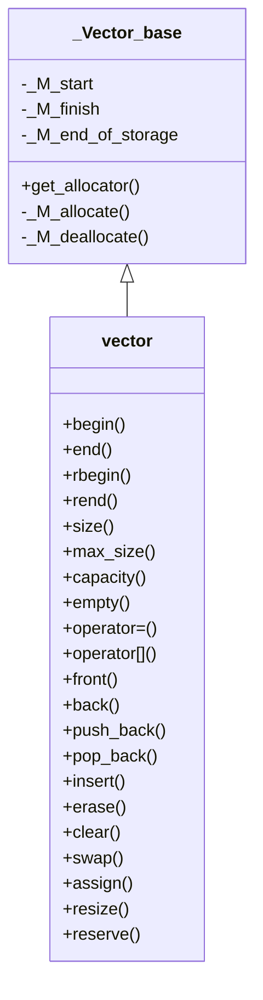

# vector 源码解析

> 当前文档为 SGI 的 vector 容器的阅读笔记

## 相关头文件

- vector
- vector.h
- stl_vector.h

## 类结构

- vector 派生于 _Vector_base
- _Vector_base 主要用于存储管理和存储接口
- vector 包含各种操作接口

### 关系图如下



## 存储管理

> 存储管理主要在基类 _Vector_base 中实现，下列是使用 SGI 简单分配器的实现源码

### SGI 源码

```c++
template <class _Tp, class _Alloc> 
class _Vector_base {
public:
    typedef _Alloc allocator_type;
    allocator_type get_allocator() const { return allocator_type(); }

    _Vector_base(const _Alloc&)
        : _M_start(0), _M_finish(0), _M_end_of_storage(0) {}
    _Vector_base(size_t __n, const _Alloc&)
        : _M_start(0), _M_finish(0), _M_end_of_storage(0) 
    {
        _M_start = _M_allocate(__n);
        _M_finish = _M_start;
        _M_end_of_storage = _M_start + __n;
    }

    ~_Vector_base() { _M_deallocate(_M_start, _M_end_of_storage - _M_start); }

protected:
    _Tp* _M_start;
    _Tp* _M_finish;
    _Tp* _M_end_of_storage;

    typedef simple_alloc<_Tp, _Alloc> _M_data_allocator;
    _Tp* _M_allocate(size_t __n)
        { return _M_data_allocator::allocate(__n); }
    void _M_deallocate(_Tp* __p, size_t __n) 
        { _M_data_allocator::deallocate(__p, __n); }
};
```

### 成员解析

|关键成员变量|作用|
|:--:|:--:|
|_M_start|数据起始位置|
|_M_finish|已使用内存结束位置|
|_M_end_of_storage|总内存结束位置|

|关键成员函数|作用|
|:--:|:--:|
|_M_allocate|分配内存|
|_M_deallocate|释放内存|

## 关键操作实现

### 构造函数源码解析

```c++
explicit vector(const allocator_type& __a = allocator_type())
    : _Base(__a) {} // 内存分配器可动态传入

vector(size_type __n, const _Tp& __value,
        const allocator_type& __a = allocator_type()) 
    : _Base(__n, __a)
    { _M_finish = uninitialized_fill_n(_M_start, __n, __value); } // 初始化 n 个元素，并支持自定义内存分配器

explicit vector(size_type __n)
    : _Base(__n, allocator_type())
    { _M_finish = uninitialized_fill_n(_M_start, __n, _Tp()); } // 初始化 n 个空元素，并支持自定义内存分配器

vector(const vector<_Tp, _Alloc>& __x) 
    : _Base(__x.size(), __x.get_allocator())
    { _M_finish = uninitialized_copy(__x.begin(), __x.end(), _M_start); } // 拷贝构造

#ifdef __STL_MEMBER_TEMPLATES
// Check whether it's an integral type.  If so, it's not an iterator.
// 根绝迭代器范围构造
template <class _InputIterator>
vector(_InputIterator __first, _InputIterator __last,
        const allocator_type& __a = allocator_type()) : _Base(__a) {
    typedef typename _Is_integer<_InputIterator>::_Integral _Integral;
    _M_initialize_aux(__first, __last, _Integral());
}

// 仅针对传统类型，比如整数等
template <class _Integer>
void _M_initialize_aux(_Integer __n, _Integer __value, __true_type) {
    _M_start = _M_allocate(__n);
    _M_end_of_storage = _M_start + __n; 
    _M_finish = uninitialized_fill_n(_M_start, __n, __value);
}

// 针对迭代器类型
template <class _InputIterator>
void _M_initialize_aux(_InputIterator __first, _InputIterator __last,
                        __false_type) {
    _M_range_initialize(__first, __last, __ITERATOR_CATEGORY(__first));
}

#else
// 非模板构造
vector(const _Tp* __first, const _Tp* __last,
        const allocator_type& __a = allocator_type())
    : _Base(__last - __first, __a) 
    { _M_finish = uninitialized_copy(__first, __last, _M_start); }
#endif /* __STL_MEMBER_TEMPLATES */

// 析构函数
~vector() { destroy(_M_start, _M_finish); } // 调用元素的析构函数，内存由基类回收
```

### push_back 源码解析

> 作用：在结尾追加元素
> 时间复杂度：有空间时为 O(1)；扩容时为 O(n)
> 迭代器失效：会造成 end() 迭代器失效；扩容时会造成迭代器失效

```c++
// 将 __x 追加至容器尾部
void push_back(const _Tp& __x) {
    if (_M_finish != _M_end_of_storage) { // 有空间
        construct(_M_finish, __x); // 在 _M_finish 位置调用构造函数
        ++_M_finish;
    }
    else
        _M_insert_aux(end(), __x); // 扩容插入
}

// 在容器尾部新增默认值
void push_back() {
    if (_M_finish != _M_end_of_storage) {
        construct(_M_finish);
        ++_M_finish;
    }
    else
        _M_insert_aux(end());
}
```

### insert 源码解析

```c++
// 在 __position 位置前插入 __x 元素
iterator insert(iterator __position, const _Tp& __x) {
    size_type __n = __position - begin();
    if (_M_finish != _M_end_of_storage && __position == end()) { // 有空间且是结尾的位置，直接构造即可
        construct(_M_finish, __x);
        ++_M_finish;
    }
    else
        _M_insert_aux(__position, __x); // 扩容插入
    return begin() + __n;
}
// 在 __position 位置前插入空元素
iterator insert(iterator __position) {
    size_type __n = __position - begin();
    if (_M_finish != _M_end_of_storage && __position == end()) {
        construct(_M_finish);
        ++_M_finish;
    }
    else
        _M_insert_aux(__position);
    return begin() + __n;
}
// 在 __position 位置前插入 __first 到 __last 的数据
template <class _Tp, class _Alloc>
void 
vector<_Tp, _Alloc>::insert(iterator __position, 
                            const_iterator __first, 
                            const_iterator __last)
{
  if (__first != __last) { // 待插入数量不为 0
    size_type __n = 0;
    distance(__first, __last, __n); // 计算 __first 和 __last 的距离，并加于 __n
    if (size_type(_M_end_of_storage - _M_finish) >= __n) { // 剩余空间足够容纳目标数量
      const size_type __elems_after = _M_finish - __position; // 需要向后移动的元素数量
      iterator __old_finish = _M_finish;
      if (__elems_after > __n) { // 需要移动的数量大于目标数量
        uninitialized_copy(_M_finish - __n, _M_finish, _M_finish); // 不需要覆盖的地方进行拷贝，finish 后面的区域均需要走构造的拷贝
        _M_finish += __n; // 优先加上，因为后续数据已经拷贝
        copy_backward(__position, __old_finish - __n, __old_finish); // 向后拷贝原空间剩余元素，最后一个参数给结束位置，从最后的元素开始拷贝
        copy(__first, __last, __position); // 拷贝目标数据
      }
      else { // 需要移动的数量小于等于目标数量
        uninitialized_copy(__first + __elems_after, __last, _M_finish); // 先拷贝目标数据超出原有空间的元素
        _M_finish += __n - __elems_after;
        uninitialized_copy(__position, __old_finish, _M_finish); // 将原始数据拷贝到后面的位置
        _M_finish += __elems_after;
        copy(__first, __first + __elems_after, __position); // 拷贝目标数据未超出原有空间的元素
      }
    }
    else { // 剩余空间不能容纳目标数量
      const size_type __old_size = size(); // 旧大小
      // 新大小 = 旧大小 + 旧大小和新大小的最大值
      const size_type __len = __old_size + max(__old_size, __n); // 计算新大小
      iterator __new_start = _M_allocate(__len); // 分配新空间到 __new_start
      iterator __new_finish = __new_start;
      __STL_TRY {
        __new_finish = uninitialized_copy(_M_start, __position, __new_start); //拷贝旧数据前一部分到新空间
        __new_finish = uninitialized_copy(__first, __last, __new_finish); // 拷贝目标数据到新空间
        __new_finish
          = uninitialized_copy(__position, _M_finish, __new_finish); // 拷贝旧数据后一部分到新空间
        // __new_finish 为每次拷贝后的最后一个元素后面的位置
      }
      __STL_UNWIND((destroy(__new_start,__new_finish),
                    _M_deallocate(__new_start,__len))); 
      destroy(_M_start, _M_finish); // 销毁原始空间元素，调用析构函数
      _M_deallocate(_M_start, _M_end_of_storage - _M_start); // 释放原始空间内存
      _M_start = __new_start;
      _M_finish = __new_finish;
      _M_end_of_storage = __new_start + __len;
    }
  }
}

// 在 pos 前插入 n 个 x 值
void insert(iterator __pos, size_type __n, const _Tp& __x) {
    _M_fill_insert(__pos, __n, __x); // 填充插入值
}
```

### pop_back 源码解析

```c++
void pop_back() {
    --_M_finish;
    destroy(_M_finish); // 销毁结尾的数据
}
```

### erase 源码解析

```c++
iterator erase(iterator __position) {
    if (__position + 1 != end()) // pos不是最后一个元素
      copy(__position + 1, _M_finish, __position); // 向前拷贝剩余元素
    --_M_finish;
    destroy(_M_finish); // 销毁最后一个元素
    return __position;
}
iterator erase(iterator __first, iterator __last) {
    iterator __i = copy(__last, _M_finish, __first); // 向前拷贝数据，返回拷贝后结尾的位置
    destroy(__i, _M_finish); // 销毁新的结尾到旧结尾的元素
    _M_finish = _M_finish - (__last - __first);
    return __first;
}
```

### resize 源码解析

```c++
void resize(size_type __new_size, const _Tp& __x) {
    if (__new_size < size()) // 新的大小小于当前大小
      erase(begin() + __new_size, end()); // 删除新结尾后面的有效数据
    else // 新的大小大于等于当前大小
      insert(end(), __new_size - size(), __x); // 在结尾的位置插入 __new_size - size() 个数据
}
void resize(size_type __new_size) { resize(__new_size, _Tp()); }
```

### clear 源码解析

```c++
void clear() { erase(begin(), end()); } // 删除所有元素
```

### reserve 源码解析

```c++
// 修改容器容量大小
void reserve(size_type __n) {
    if (capacity() < __n) { // 当前容量小于目标容量
        const size_type __old_size = size(); // 当前数据大小
        iterator __tmp = _M_allocate_and_copy(__n, _M_start, _M_finish); // 按新大小重新分配内存并
        destroy(_M_start, _M_finish); // 销毁旧数据，循环调用析构函数
        _M_deallocate(_M_start, _M_end_of_storage - _M_start); // 释放旧空间内存
        _M_start = __tmp;
        _M_finish = __tmp + __old_size;
        _M_end_of_storage = _M_start + __n;
    }
}
```

### assign 源码解析

> 作用：重新填充分配 n 个元素值均为 val

```c++
void assign(size_type __n, const _Tp& __val) { _M_fill_assign(__n, __val); }
```

### operator 源码解析

```c++
// 判断是否相等
template <class _Tp, class _Alloc>
inline bool 
operator==(const vector<_Tp, _Alloc>& __x, const vector<_Tp, _Alloc>& __y)
{
    return __x.size() == __y.size() &&
         equal(__x.begin(), __x.end(), __y.begin()); // 数量相同且各元素相同
}

// 判断是否小于
template <class _Tp, class _Alloc>
inline bool 
operator<(const vector<_Tp, _Alloc>& __x, const vector<_Tp, _Alloc>& __y)
{
    return lexicographical_compare(__x.begin(), __x.end(), 
                                 __y.begin(), __y.end()); // 循环小于对比
}

// 赋值拷贝
template <class _Tp, class _Alloc>
vector<_Tp,_Alloc>& 
vector<_Tp,_Alloc>::operator=(const vector<_Tp, _Alloc>& __x) {
    if (&__x != this) { // 判断不是自己，不是自己才需要拷贝
        const size_type __xlen = __x.size();
        if (__xlen > capacity()) { // 需要重新新分配空间并拷贝
            iterator __tmp = _M_allocate_and_copy(__xlen, __x.begin(), __x.end()); // 重新分配空间且拷贝数据，返回分配的空间
            destroy(_M_start, _M_finish); // 销毁原空间内元素
            _M_deallocate(_M_start, _M_end_of_storage - _M_start); // 释放内存空间
            _M_start = __tmp;
            _M_end_of_storage = _M_start + __xlen;
        }
        else if (size() >= __xlen) { // 当前大小与目标大小相等或比目标大小大
            iterator __i = copy(__x.begin(), __x.end(), begin()); // 拷贝数据，返回新数据的结尾
            destroy(__i, _M_finish); // 销毁多余的元素
        }
        else { // 当前大小小于目标大小，但是内存容量能够容纳目标大小
            copy(__x.begin(), __x.begin() + size(), _M_start); // 在当前已用空间内拷贝数据
            uninitialized_copy(__x.begin() + size(), __x.end(), _M_finish); // 剩余数据使用未初始化拷贝方式，其会调用构造方法
        }
        _M_finish = _M_start + __xlen;
    }
    return *this;
}
```

## 内部操作实现

### _M_allocate_and_copy 源码解析

> 分配新内存并拷贝数据，常用于将新数据放入新空间功能中，并返回新空间

```c++
iterator _M_allocate_and_copy(size_type __n, const_iterator __first, 
                                               const_iterator __last)
{
    iterator __result = _M_allocate(__n); // 分配 n 个元素的内存空间到 __result
    __STL_TRY {
      uninitialized_copy(__first, __last, __result); // 循环进行拷贝构造
      return __result;
    }
    __STL_UNWIND(_M_deallocate(__result, __n));
}
```

### _M_fill_assign 源码解析

> 作用：重新填充分配 n 个元素值为 val，常用于 assign 接口

```c++
template <class _Tp, class _Alloc>
void vector<_Tp, _Alloc>::_M_fill_assign(size_t __n, const value_type& __val) 
{
  if (__n > capacity()) { // 分配的数量大于容量
    vector<_Tp, _Alloc> __tmp(__n, __val, get_allocator()); // 构造临时对象
    __tmp.swap(*this); // 交换临时对象
  }
  else if (__n > size()) { // 分配的数量大于已使用空间
    fill(begin(), end(), __val); // 填充已使用空间
    _M_finish = uninitialized_fill_n(_M_finish, __n - size(), __val); // 多余的元素进行构造填充，实际循环调用构造函数
  }
  else // 分配的数量小于已使用空间
    erase(fill_n(begin(), __n, __val), end()); //首先填充 n 个元素空间；然后删除 n 个后面的已使用空间 
}
```

### _M_insert_aux 源码解析

> 作用：在 pos 前插入数据，aux 后缀表示 auxiliary（辅助的），表示当前函数为辅助函数

```c++
template <class _Tp, class _Alloc>
void 
vector<_Tp, _Alloc>::_M_insert_aux(iterator __position, const _Tp& __x)
{
    if (_M_finish != _M_end_of_storage) { // 如果容量还有空间
        construct(_M_finish, *(_M_finish - 1)); // 在 finish 的位置构造元素，用最后一个元素值进行构造
        ++_M_finish;
        _Tp __x_copy = __x;
        copy_backward(__position, _M_finish - 2, _M_finish - 1); // 将 pos 到 finish - 2 向后拷贝一个单元
        *__position = __x_copy; // 将 x 赋值给 pos 的空间
    }
    else { // 容量满了，空间不足，需要扩容
        const size_type __old_size = size();
        const size_type __len = __old_size != 0 ? 2 * __old_size : 1; // 2 倍扩容
        iterator __new_start = _M_allocate(__len);
        iterator __new_finish = __new_start;
        __STL_TRY {
            __new_finish = uninitialized_copy(_M_start, __position, __new_start); // 拷贝 pos 前的数据到新空间
            construct(__new_finish, __x); // 拷贝 x 数据到新空间
            ++__new_finish;
            __new_finish = uninitialized_copy(__position, _M_finish, __new_finish); // 拷贝 pos 以及之后的数据到新空间
        }
        __STL_UNWIND((destroy(__new_start,__new_finish), 
                    _M_deallocate(__new_start,__len)));
        destroy(begin(), end()); // 销毁旧数据，调用各元素析构函数
        _M_deallocate(_M_start, _M_end_of_storage - _M_start); // 释放旧空间内存
        _M_start = __new_start;
        _M_finish = __new_finish;
        _M_end_of_storage = __new_start + __len;
    }
}

// 在 pos 前查询空元素，具体解析参考上述函数
template <class _Tp, class _Alloc>
void 
vector<_Tp, _Alloc>::_M_insert_aux(iterator __position)
{
    if (_M_finish != _M_end_of_storage) {
        construct(_M_finish, *(_M_finish - 1));
        ++_M_finish;
        copy_backward(__position, _M_finish - 2, _M_finish - 1);
        *__position = _Tp();
    }
    else {
        const size_type __old_size = size();
        const size_type __len = __old_size != 0 ? 2 * __old_size : 1;
        iterator __new_start = _M_allocate(__len);
        iterator __new_finish = __new_start;
        __STL_TRY {
        __new_finish = uninitialized_copy(_M_start, __position, __new_start);
        construct(__new_finish);
        ++__new_finish;
        __new_finish = uninitialized_copy(__position, _M_finish, __new_finish);
        }
        __STL_UNWIND((destroy(__new_start,__new_finish), 
                    _M_deallocate(__new_start,__len)));
        destroy(begin(), end());
        _M_deallocate(_M_start, _M_end_of_storage - _M_start);
        _M_start = __new_start;
        _M_finish = __new_finish;
        _M_end_of_storage = __new_start + __len;
    }
}
```

### _M_fill_insert 源码解析

> 作用：在 pos 之前填充插入 n 个 x 元素

```c++
template <class _Tp, class _Alloc>
void vector<_Tp, _Alloc>::_M_fill_insert(iterator __position, size_type __n, 
                                         const _Tp& __x)
{
    if (__n != 0) { // 填充数量不为 0
        if (size_type(_M_end_of_storage - _M_finish) >= __n) { // 未使用空间大于等于目标数量，能够存放新数据
            _Tp __x_copy = __x;
            const size_type __elems_after = _M_finish - __position; // 目前需要向后移动的元素数量
            iterator __old_finish = _M_finish;
            if (__elems_after > __n) { // 向后移动的元素数量大于新填充插入的数量
                uninitialized_copy(_M_finish - __n, _M_finish, _M_finish); // 将旧数据后半截拷贝至后面的区域
                _M_finish += __n;
                copy_backward(__position, __old_finish - __n, __old_finish); // 拷贝旧数据剩余空间到原空间后半截区域
                fill(__position, __position + __n, __x_copy); // 在目标区域填充新元素
            }
            else {
                uninitialized_fill_n(_M_finish, __n - __elems_after, __x_copy); // 将新元素后半截元素向后填充拷贝
                _M_finish += __n - __elems_after;
                uninitialized_copy(__position, __old_finish, _M_finish); // 将旧元素拷贝至后面的空间
                _M_finish += __elems_after;
                fill(__position, __old_finish, __x_copy); // 将新元素填充旧空间剩余数据
            }
        }
        else { // 未使用空间大小不能够存放新数据，直接申请新空间
            const size_type __old_size = size();
            const size_type __len = __old_size + max(__old_size, __n);
            iterator __new_start = _M_allocate(__len);
            iterator __new_finish = __new_start;
            __STL_TRY {
                __new_finish = uninitialized_copy(_M_start, __position, __new_start); // 将旧数据前半截拷贝纸新空间
                __new_finish = uninitialized_fill_n(__new_finish, __n, __x); // 在指定位置填充新元素
                __new_finish
                = uninitialized_copy(__position, _M_finish, __new_finish); // 拷贝旧数据剩余数据到新空间
            }
            __STL_UNWIND((destroy(__new_start,__new_finish), 
                            _M_deallocate(__new_start,__len)));
            destroy(_M_start, _M_finish); // 销毁旧元素，循环调用旧元素析构函数
            _M_deallocate(_M_start, _M_end_of_storage - _M_start); // 释放旧空间内存
            _M_start = __new_start;
            _M_finish = __new_finish;
            _M_end_of_storage = __new_start + __len;
        }
    }
}
```

## 扩容机制

1. 插入一个数据时
    - 容量不够时，通常扩容两倍

2. 批量插入数据时，如：使用以下函数时
    ```c++
    void insert(iterator __position, const_iterator __first, const_iterator __last);
    ```
    - 容量不够时，通常扩容为 旧大小 + 旧大小和新数据数量的最大值

## 迭代器失效规则

1. 迭代器类型就是裸指针（value_type* / const value_type*）。
2. 失效规则：
    1. 任何导致重新分配（容量不足时）都会使所有迭代器、引用失效。
    2. 非重新分配情况下：插入/删除位于尾部（push_back、pop_back）通常只影响 end()。
3. 在中间插入会移动后续元素（通过 copy_backward/uninitialized_copy），因此后面元素对应的迭代器失效。

## 常见面试题

1. vector 的底层实现？
> 动态数组，连续内存，支持随机访问。

2. 扩容机制？
> 一般为 2 倍扩容，拷贝/移动旧元素，迭代器失效。

3. 迭代器失效的情况？
> 扩容、插入、删除。

4. reserve 与 resize 的区别？
> reserve 只影响容量，不改变 size
> resize 会改变 size，多出的元素会默认构造

5. emplace_back 与 push_back 的区别？
> emplace_back 原地构造，避免临时对象。

6. vector 删除元素时，迭代器如何安全使用？
> 用 erase 返回的迭代器继续循环，示例如下：
```c++
for (auto it = v.begin(); it != v.end(); ) {
    if (*it % 2 == 0) it = v.erase(it); // 返回下一个有效迭代器
    else ++it;
}
```

---