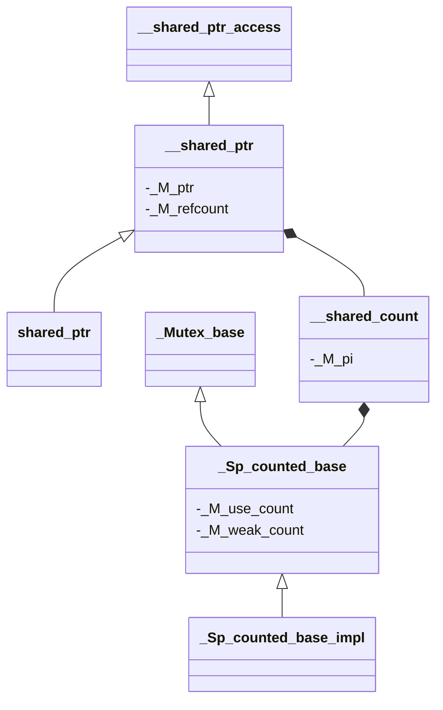

# 共享指针源码解析

> 当前文档为 GNU Standard C++ Library (libstdc++) 的共享指针的阅读笔记

## 相关头文件

- memory
- bits/shared_ptr.h
- bits/shared_ptr_base.h

## 类结构

- __shared_count、_Sp_counted_base 主要存储引用计数控制块数据
- __shared_ptr 主要用于共享指针核心功能实现
- shared_ptr 主要用于共享指针对外提供操作，内部封装 __shared_ptr 操作

### 类关系图



## __shared_ptr 源码解析

> __shared_ptr 中包含两个成员变量，一个为指向元素的指针，另一个为引用计数的对象，使用 __shared_count 表示

```c++
    element_type*	   _M_ptr;         // 元素指针
    __shared_count<_Lp>  _M_refcount;    // 引用技术
```

> 在 __shared_count 中，使用 _Sp_counted_base 的指针表示其内容，_Sp_counted_base 内部实际包含了使用计数和 weak 计数，以下为 __shared_count 中的成员变量

```c++
    _Sp_counted_base<_Lp>*  _M_pi;
```

> 在 _Sp_counted_base 中，使用 atomic 变量表示使用计数，如下所示

```c++
    _Atomic_word  _M_use_count;     // #shared
    _Atomic_word  _M_weak_count;    // #weak + (#shared != 0)
```

> 在构造 shared_ptr 时，实际会调用 __shared_ptr 的构造函数，会初始化内部元素指针和引用计数对象，代码如下：

```c++
// 其中一个构造函数
template<typename _Yp, typename = _SafeConv<_Yp>>
explicit __shared_ptr(_Yp* __p) : _M_ptr(__p), _M_refcount(__p, typename is_array<_Tp>::type())
{
    static_assert( !is_void<_Yp>::value, "incomplete type" );
    static_assert( sizeof(_Yp) > 0, "incomplete type" );
    _M_enable_shared_from_this_with(__p);
}
```

```c++
// 非数组类型的引用计数初始化
template<typename _Ptr>
explicit __shared_count(_Ptr __p) : _M_pi(0)
{
    __try
    {
        _M_pi = new _Sp_counted_ptr<_Ptr, _Lp>(__p); // 针对指针对象的引用计数
    }
    __catch(...)
    {
        delete __p;
        __throw_exception_again;
    }
}
```

> 在使用 shared_ptr 拷贝给其他 shared_ptr 时会进行拷贝构造或拷贝，同时会进行指针和引用计数的拷贝

```c++
template<typename _Yp>
__shared_ptr(const __shared_ptr<_Yp, _Lp>& __r, element_type* __p) noexcept
: _M_ptr(__p), _M_refcount(__r._M_refcount) { }

__shared_ptr(const __shared_ptr&) noexcept = default;
__shared_ptr& operator=(const __shared_ptr&) noexcept = default;
```

> 引用计数对象的拷贝会触发引用计数的增加，代码如下列所示

```c++
__shared_count(const __shared_count& __r) noexcept: _M_pi(__r._M_pi)
{
    if (_M_pi != nullptr)
        _M_pi->_M_add_ref_copy(); // 增加引用计数
}

__shared_count& operator=(const __shared_count& __r) noexcept
{
    _Sp_counted_base<_Lp>* __tmp = __r._M_pi;
    if (__tmp != _M_pi) // 不是同一个控制块
    {
        if (__tmp != nullptr)
            __tmp->_M_add_ref_copy(); // 增加引用计数
        if (_M_pi != nullptr)
            _M_pi->_M_release(); // 如果当前有值，内部判断引用计数判断是否需要释放对象
        _M_pi = __tmp;
    }
    return *this;
}
```

> 在析构时会判断引用计数是否为 0，为 0 则进行内存的释放

```c++
~__shared_count() noexcept
{
    if (_M_pi != nullptr)
        _M_pi->_M_release(); // 如果当前有值，内部判断引用计数判断是否需要释放对象
}
```

> 关于 _M_release 的三种特化版本实现如下，最终均会调用 _M_dispose、_M_destroy 释放目标对象和控制块；
> _M_dispose 用于释放目标对象；
> _M_destroy 用于释放引用计数控制块；

```c++
template<>
inline void _Sp_counted_base<_S_single>::_M_release() noexcept
{
    if (--_M_use_count == 0)
    {
        _M_dispose(); // 释放目标指针内存
        if (--_M_weak_count == 0)
            _M_destroy(); // 销毁当前引用计数控制块
    }
}

template<>
inline void _Sp_counted_base<_S_mutex>::_M_release() noexcept
{
    _GLIBCXX_SYNCHRONIZATION_HAPPENS_BEFORE(&_M_use_count);
    if (__gnu_cxx::__exchange_and_add_dispatch(&_M_use_count, -1) == 1)
    {
        _M_release_last_use();
    }
}

template<>
inline void _Sp_counted_base<_S_atomic>::_M_release() noexcept
{
    _GLIBCXX_SYNCHRONIZATION_HAPPENS_BEFORE(&_M_use_count);
#if ! _GLIBCXX_TSAN
        constexpr bool __lock_free = __atomic_always_lock_free(sizeof(long long), 0)
            && __atomic_always_lock_free(sizeof(_Atomic_word), 0);
        constexpr bool __double_word = sizeof(long long) == 2 * sizeof(_Atomic_word);
        // The ref-count members follow the vptr, so are aligned to
        // alignof(void*).
        constexpr bool __aligned = __alignof(long long) <= alignof(void*);
        if _GLIBCXX17_CONSTEXPR (__lock_free && __double_word && __aligned)
        {
            constexpr int __wordbits = __CHAR_BIT__ * sizeof(_Atomic_word);
            constexpr int __shiftbits = __double_word ? __wordbits : 0;
            constexpr long long __unique_ref = 1LL + (1LL << __shiftbits);
            auto __both_counts = reinterpret_cast<long long*>(&_M_use_count);

            _GLIBCXX_SYNCHRONIZATION_HAPPENS_BEFORE(&_M_weak_count);
            if (__atomic_load_n(__both_counts, __ATOMIC_ACQUIRE) == __unique_ref)
            {
                // Both counts are 1, so there are no weak references and
                // we are releasing the last strong reference. No other
                // threads can observe the effects of this _M_release()
                // call (e.g. calling use_count()) without a data race.
                _M_weak_count = _M_use_count = 0;
                _GLIBCXX_SYNCHRONIZATION_HAPPENS_AFTER(&_M_use_count);
                _GLIBCXX_SYNCHRONIZATION_HAPPENS_AFTER(&_M_weak_count);
                _M_dispose();
                _M_destroy();
                return;
            }
            if (__gnu_cxx::__exchange_and_add_dispatch(&_M_use_count, -1) == 1)
            [[__unlikely__]]
            {
                _M_release_last_use_cold();
                return;
            }
        }
        else
#endif
        if (__gnu_cxx::__exchange_and_add_dispatch(&_M_use_count, -1) == 1)
        {
            _M_release_last_use();
        }
}


void _M_release_last_use() noexcept
{
    _GLIBCXX_SYNCHRONIZATION_HAPPENS_AFTER(&_M_use_count);
    _M_dispose(); // 释放目标指针内存

    if (_Mutex_base<_Lp>::_S_need_barriers)
    {
        __atomic_thread_fence (__ATOMIC_ACQ_REL);
    }

    _GLIBCXX_SYNCHRONIZATION_HAPPENS_BEFORE(&_M_weak_count);
    if (__gnu_cxx::__exchange_and_add_dispatch(&_M_weak_count, -1) == 1)
    {
        _GLIBCXX_SYNCHRONIZATION_HAPPENS_AFTER(&_M_weak_count);
        _M_destroy(); // 销毁引用计数控制块
    }
}
```

> make_shared 会构造同一块内存存放目标对象和引用计数控制块，降低内存申请次数；
> 使用 _Sp_alloc_shared_tag 会触发申请同一块内存的构造函数

```c++
template<typename _Tp, _Lock_policy _Lp = __default_lock_policy, typename _Alloc, typename... _Args>
inline __shared_ptr<_Tp, _Lp> __allocate_shared(const _Alloc& __a, _Args&&... __args)
{
    static_assert(!is_array<_Tp>::value, "make_shared<T[]> not supported");

    return __shared_ptr<_Tp, _Lp>(_Sp_alloc_shared_tag<_Alloc>{__a}, std::forward<_Args>(__args)...);
}

template<typename _Tp, _Lock_policy _Lp = __default_lock_policy, typename... _Args>
inline __shared_ptr<_Tp, _Lp> __make_shared(_Args&&... __args)
{
    typedef typename std::remove_const<_Tp>::type _Tp_nc;
    return std::__allocate_shared<_Tp, _Lp>(std::allocator<_Tp_nc>(), std::forward<_Args>(__args)...);
}
```

## enable_shared_from_this 源码解析

> 在 shared_ptr 的构造过程中会调用到 enable_shared_from_this 的 _M_weak_assign 方法，对内部的 weak_ptr 进行初始化；
> enable_shared_from_this 实际内部会存储 this 的 weak_ptr，在外部获取 shared_ptr 时使用 weak_ptr 构造 shared_ptr，这样能够使用到同一块引用计数控制块；

```c++
template<typename _Tp>
class enable_shared_from_this
{
protected:
    constexpr enable_shared_from_this() noexcept { }
    enable_shared_from_this(const enable_shared_from_this&) noexcept { }
    enable_shared_from_this& operator=(const enable_shared_from_this&) noexcept
    { return *this; }
    ~enable_shared_from_this() { }
public:
    shared_ptr<_Tp> shared_from_this()
    { return shared_ptr<_Tp>(this->_M_weak_this); }

    shared_ptr<const _Tp> shared_from_this() const
    { return shared_ptr<const _Tp>(this->_M_weak_this); }

#if __cplusplus > 201402L || !defined(__STRICT_ANSI__) // c++1z or gnu++11
#define __cpp_lib_enable_shared_from_this 201603L
    weak_ptr<_Tp> weak_from_this() noexcept
    { return this->_M_weak_this; }

    weak_ptr<const _Tp> weak_from_this() const noexcept
    { return this->_M_weak_this; }
#endif

private:
    template<typename _Tp1>
    void _M_weak_assign(_Tp1* __p, const __shared_count<>& __n) const noexcept
    { _M_weak_this._M_assign(__p, __n); }

    // Found by ADL when this is an associated class.
    friend const enable_shared_from_this* 
    __enable_shared_from_this_base(const __shared_count<>&, const enable_shared_from_this* __p)
    { return __p; }

    template<typename, _Lock_policy>
    friend class __shared_ptr;

    mutable weak_ptr<_Tp>  _M_weak_this;
};
```

## 常见面试题

### **1. 基础概念题**

**Q1: 请解释 `std::shared_ptr` 是如何工作的？它的核心机制是什么？**
*   **考察点**：对引用计数基本原理的理解。
*   **参考答案**：
    > `std::shared_ptr` 通过**引用计数（Reference Counting）** 机制来管理多个智能指针共享同一个动态分配的对象。
    > 1.  **核心**：每个被 `shared_ptr` 管理的对象都有一个关联的**控制块**，里面至少保存着一个**强引用计数**。
    > 2.  **拷贝构造/赋值**：当一个 `shared_ptr` 被拷贝给另一个时，它们指向同一个对象和控制块，并且**强引用计数会原子性地增加**。
    > 3.  **析构**：当一个 `shared_ptr` 被销毁或重置时，它会原子性地**减少强引用计数**。
    > 4.  **释放条件**：当**强引用计数减为 0** 时，说明没有任何 `shared_ptr` 再需要这个对象，`shared_ptr` 就会调用删除器（默认是 `delete`）来销毁对象并释放其内存。
    > 5.  **控制块释放**：控制块内部还有一个**弱引用计数**。当强引用和弱引用计数都变为 0 时，控制块自身的内存才会被释放。

**Q2: `std::shared_ptr` 和 `std::unique_ptr` 的根本区别是什么？**
*   **考察点**：对所有权模型的理解。
*   **参考答案**：
    > 最根本的区别在于**所有权的模型**：
    > *   **`std::unique_ptr`**：实行**独占所有权**。一个对象只能被一个 `unique_ptr` 拥有。它通过禁止拷贝、只允许移动语义来保证这一点。优点是**零开销**，效率高。
    > *   **`std::shared_ptr`**：实行**共享所有权**。多个 `shared_ptr` 实例可以“共享”同一个对象的所有权。它通过引用计数来实现这一点。优点是方便，但因为有引用计数和控制块的开销，所以**比 `unique_ptr` 更重**。
    > *   **选择原则**：默认优先使用 `unique_ptr`，只在确实需要共享所有权时才使用 `shared_ptr`。

---

### **2. 线程安全题**

**Q3: `std::shared_ptr` 是线程安全的吗？**
*   **考察点**：对线程安全分层模型的深刻理解。这是最高频的面试题之一。
*   **参考答案**：
    > 这是一个需要分层面回答的问题：
    > 1.  **控制块操作是线程安全的**：`shared_ptr` 的引用计数的增减是**原子操作**（通常使用 `std::memory_order_relaxed`），这保证了多个线程同时拷贝或析构**指向同一对象的不同 `shared_ptr` 实例**时，不会发生计数错误或资源重复释放。这是 `shared_ptr` 保证的最基础的线程安全。
    > 2.  **`shared_ptr` 实例本身的读写不是线程安全的**：多个线程同时**读写同一个 `shared_ptr` 实例**（例如，线程A `reset` 它，线程B同时拷贝它）是**不安全**的，需要额外的同步（如互斥锁）。因为修改实例本身（改变其内部指针）不是原子操作。
    > 3.  **所指向对象的数据不是线程安全的**：`shared_ptr` **只管理内存的生命周期，不保证所管理对象本身的线程安全**。多个线程通过不同的 `shared_ptr` 去读写同一个对象，和操作裸指针一样，会产生数据竞争，需要程序员自己用同步机制（如 `std::mutex`）来保护。
    >
    > **总结**：`shared_ptr` 保证了内核（控制块/引用计数）的线程安全，但不管外壳（实例本身和对象数据）的线程安全。

---

### **3. 经典陷阱题**

**Q4: 什么是循环引用？如何解决它？**
*   **考察点**：对 `weak_ptr` 应用场景的掌握。
*   **参考答案**：
    > *   **循环引用**：指两个或多个对象通过 `shared_ptr` 互相持有，形成一个环。这将导致每个对象的引用计数永远至少为 1，从而无法被析构，造成内存泄漏。
    >     ```cpp
    >     class B;
    >     class A {
    >     public:
    >         std::shared_ptr<B> b_ptr;
    >     };
    >     class B {
    >     public:
    >         std::shared_ptr<A> a_ptr; // 循环引用！
    >     };
    >     ```
    > *   **解决方案**：使用 `std::weak_ptr`。`weak_ptr` 是一种不控制对象生命周期的智能指针，它指向一个由 `shared_ptr` 管理的对象，但**不会增加其引用计数**。将上述例子中 `B::a_ptr` 的类型改为 `std::weak_ptr<A>` 即可打破循环。需要访问时，调用 `weak_ptr::lock()` 方法尝试获取一个有效的 `shared_ptr`。

**Q5: 为什么应该优先使用 `std::make_shared` 而不是直接使用 `new` 来创建 `shared_ptr`？**
*   **考察点**：对性能优化和异常安全的理解。
*   **参考答案**：
    > 主要有两大优势：
    > 1.  **性能效率**：`std::make_shared` 通常只需一次内存分配，因为它有机会将**对象本身和控制块分配在单块连续的内存**中。而直接使用 `new` 则需要两次分配（一次给对象，一次给控制块），减少了内存碎片和分配开销。
    > 2.  **异常安全**：考虑函数调用 `foo(std::shared_ptr<T>(new T), bar())`。C++ 未规定函数参数的求值顺序，可能的执行顺序是：`new T` -> `bar()` -> `shared_ptr 构造函数`。如果 `bar()` 抛出异常，那么 `new T` 分配的内存就会泄漏。使用 `make_shared` 可以避免这个问题：`foo(std::make_shared<T>(), bar())`，因为 `make_shared` 的调用是原子的。

**Q6: 使用 `shared_ptr.get()` 方法获取的裸指针有什么危险？**
*   **考察点**：对所有权和生命周期的理解。
*   **参考答案**：
    > `get()` 返回的裸指针**没有所有权**。最大的危险是：
    > 1.  **用它创建另一个智能指针**：这会导致同一块内存被多个独立的控制块管理，最终被重复释放，引发未定义行为（通常是程序崩溃）。
    > 2.  **在 `shared_ptr` 析构后继续使用它**：这会导致悬空指针。
    > `get()` 返回的指针应该只用于访问对象，并且其生命周期绝不能超过管理它的那个 `shared_ptr` 的生命周期。

---

### **4. 设计与实现题**

**Q7: 如果要你自己实现一个引用计数智能指针，你会考虑哪些方面？**
*   **考察点**：考察知识深度和动手能力。
*   **参考答案**：
    > 我会设计一个类似 `shared_ptr` 的类模板，主要考虑：
    > 1.  **内部结构**：包含两个数据成员：一个指向管理对象的裸指针 `T* ptr`，一个指向控制块的指针 `ControlBlock* ctrl_block`。
    > 2.  **控制块设计**：控制块至少包含两个原子计数器：`strong_ref_count`（强引用）和 `weak_ref_count`（弱引用），以及一个删除器。
    > 3.  **构造/拷贝/析构**：
    >     *   **拷贝构造**：拷贝指针，指向同一个控制块，并原子性地增加 `strong_ref_count`。
    >     *   **析构**：原子性地减少 `strong_ref_count`。如果减到 0，则调用删除器释放对象；如果 `strong_ref_count` 和 `weak_ref_count` 都为 0，则释放控制块。
    > 4.  **线程安全**：对引用计数的操作必须使用原子操作来保证线程安全。
    > 5.  **移动语义**：实现移动构造函数和移动赋值运算符，它们会“窃取”资源并将源指针置为 `nullptr`，避免不必要的引用计数操作。
    > 6.  **辅助接口**：实现 `operator*`, `operator->`, `reset()`, `use_count()` 等接口。

**Q8: `std::enable_shared_from_this` 是做什么用的？什么情况下需要它？**
*   **考察点**：对特殊用例的掌握。
*   **参考答案**：
    > *   **用途**：当一个类的对象已经被一个 `shared_ptr` 管理，并且需要在该类的**成员函数内部**获取一个指向自身的 `shared_ptr` 时，就需要使用它。
    > *   **问题**：如果直接在成员函数里 `return std::shared_ptr<T>(this)`，会创建一个新的、独立的控制块，导致重复释放。
    > *   **解法**：让该类继承 `std::enable_shared_from_this<T>`，然后就可以在成员函数中安全地调用 `shared_from_this()` 方法来获取一个与已有控制块关联的 `shared_ptr`。
    > *   **注意**：**只能在对象已经被 `shared_ptr` 管理之后调用**，通常在构造函数结束后。在构造函数内调用是未定义行为。
