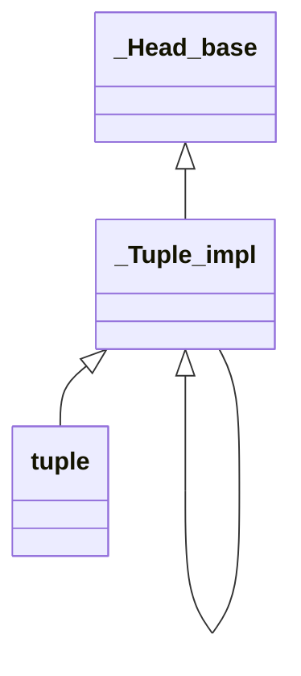

# tuple 源码解析

> 当前文档为 GNU Standard C++ Library (libstdc++) 的 tuple 的阅读笔记

## 相关头文件

- tuple

### 类结构

- tuple 表示对外类型
- _Tuple_impl 表示内部类型，用于与索引挂钩的各个类型
- _Head_base 表示每个索引实际存储的类型与数据

### 类关系图



### 源码分析

#### tuple 主版本模板类

> 主版本模板类前向声明

```c++
// 主版本模板类前向声明
template<typename... _Elements>
class tuple;

// 辅助模板类前向声明
template<size_t _Idx, typename... _Elements>
struct _Tuple_impl;
```

> 主版本模板类源码解析，以下源码仅展示重要部分
> tuple 类定义仅定义了构造函数、赋值函数、交换函数，剩余核心功能均在 _Tuple_impl 类定义中

```c++
template<typename... _Elements>
class tuple : public _Tuple_impl<0, _Elements...>
{
    typedef _Tuple_impl<0, _Elements...> _Inherited; // 表示基类的类型

    // 各种类型定义 ......

public:
    // _Elements 均为隐式默认可构造
    template<typename _Dummy = void, _ImplicitDefaultCtor<is_void<_Dummy>::value> = true>
    constexpr tuple() noexcept(__and_<is_nothrow_default_constructible<_Elements>...>::value)
        : _Inherited() { }

    // _Elements 均为显式默认可构造
    template<typename _Dummy = void, _ExplicitDefaultCtor<is_void<_Dummy>::value> = false>
    explicit constexpr tuple() noexcept(__and_<is_nothrow_default_constructible<_Elements>...>::value)
        : _Inherited() { }

    // _Elements 不为空 且 传入参数不为空，且为隐式构造
    template<bool _NotEmpty = (sizeof...(_Elements) >= 1), _ImplicitCtor<_NotEmpty, const _Elements&...> = true>
    constexpr tuple(const _Elements&... __elements) noexcept(__nothrow_constructible<const _Elements&...>())
        : _Inherited(__elements...) { }

    // _Elements 不为空 且 传入参数不为空，且为显式构造
    template<bool _NotEmpty = (sizeof...(_Elements) >= 1), _ExplicitCtor<_NotEmpty, const _Elements&...> = false>
    explicit constexpr tuple(const _Elements&... __elements) noexcept(__nothrow_constructible<const _Elements&...>())
        : _Inherited(__elements...) { }

    // _Elements 为隐式构造
    template<typename... _UElements, bool _Valid = __valid_args<_UElements...>(), _ImplicitCtor<_Valid, _UElements...> = true>
    constexpr tuple(_UElements&&... __elements) noexcept(__nothrow_constructible<_UElements...>())
        : _Inherited(std::forward<_UElements>(__elements)...) { }

    // _Elements 为显式构造
    template<typename... _UElements, bool _Valid = __valid_args<_UElements...>(), _ExplicitCtor<_Valid, _UElements...> = false>
    explicit constexpr tuple(_UElements&&... __elements) noexcept(__nothrow_constructible<_UElements...>())
        : _Inherited(std::forward<_UElements>(__elements)...) {	}

    // 默认拷贝构造
    constexpr tuple(const tuple&) = default;
    // 默认移动构造
    constexpr tuple(tuple&&) = default;

    // 通过其他 tuple 类型构造新的 tuple，且支持隐式转换
    template<typename... _UElements, bool _Valid = (sizeof...(_Elements) == sizeof...(_UElements))
        && !__use_other_ctor<const tuple<_UElements...>&>(), _ImplicitCtor<_Valid, const _UElements&...> = true>
    constexpr tuple(const tuple<_UElements...>& ___in) noexcept(__nothrow_constructible<const _UElements&...>())
        : _Inherited(static_cast<const _Tuple_impl<0, _UElements...>&>(___in)) { }

    // 通过其他 tuple 类型构造新的 tuple，且支持显式转换
    template<typename... _UElements, bool _Valid = (sizeof...(_Elements) == sizeof...(_UElements))
        && !__use_other_ctor<const tuple<_UElements...>&>(), _ExplicitCtor<_Valid, const _UElements&...> = false>
    explicit constexpr tuple(const tuple<_UElements...>& ___in) noexcept(__nothrow_constructible<const _UElements&...>())
        : _Inherited(static_cast<const _Tuple_impl<0, _UElements...>&>(___in)) { }

    // 通过其他 tuple 类型构造新的 tuple，且支持隐式转换，移动传入
    template<typename... _UElements, bool _Valid = (sizeof...(_Elements) == sizeof...(_UElements))
        && !__use_other_ctor<tuple<_UElements...>&&>(), _ImplicitCtor<_Valid, _UElements...> = true>
    constexpr tuple(tuple<_UElements...>&& ___in) noexcept(__nothrow_constructible<_UElements...>())
        : _Inherited(static_cast<_Tuple_impl<0, _UElements...>&&>(___in)) { }

    // 通过其他 tuple 类型构造新的 tuple，且支持显式转换，移动传入
    template<typename... _UElements, bool _Valid = (sizeof...(_Elements) == sizeof...(_UElements))
        && !__use_other_ctor<tuple<_UElements...>&&>(), _ExplicitCtor<_Valid, _UElements...> = false>
    explicit constexpr tuple(tuple<_UElements...>&& ___in) noexcept(__nothrow_constructible<_UElements...>())
        : _Inherited(static_cast<_Tuple_impl<0, _UElements...>&&>(___in)) { }

#if __cplusplus > 202002L
    // 使用 requires 约束，其中 explicit(!__convertible<_UElements&...>) 表示根据内部条件动态决定是否采用 explicit
    template<typename... _UElements>
    requires (sizeof...(_Elements) == sizeof...(_UElements)) 
        && (!__use_other_ctor<tuple<_UElements...>&>()) && __constructible<_UElements&...>
    explicit(!__convertible<_UElements&...>) constexpr tuple(tuple<_UElements...>& ___in) noexcept(__nothrow_constructible<_UElements&...>())
        : _Inherited(static_cast<_Tuple_impl<0, _UElements...>&>(___in)) { }

    template<typename... _UElements>
    requires (sizeof...(_Elements) == sizeof...(_UElements))
        && (!__use_other_ctor<const tuple<_UElements...>&&>()) && __constructible<const _UElements...>
    explicit(!__convertible<const _UElements...>) constexpr tuple(const tuple<_UElements...>&& ___in)
    noexcept(__nothrow_constructible<const _UElements...>())
        : _Inherited(static_cast<const _Tuple_impl<0, _UElements...>&&>(___in)) { }
#endif // C++23

    // 省略了与分配器相关的构造函数 ......

    // 拷贝赋值函数
    _GLIBCXX20_CONSTEXPR tuple& operator=(
        __conditional_t<__assignable<const _Elements&...>(), const tuple&, const __nonesuch&> ___in
    ) noexcept(__nothrow_assignable<const _Elements&...>()) {
        this->_M_assign(___in);
        return *this;
    }

    // 移动赋值函数
    _GLIBCXX20_CONSTEXPR tuple& operator=(
        __conditional_t<__assignable<_Elements...>(), tuple&&, __nonesuch&&> ___in
    ) noexcept(__nothrow_assignable<_Elements...>()) {
        this->_M_assign(std::move(___in));
        return *this;
    }

    // 将其他 tuple 类型拷贝赋值给当前 tuple 类型
    template<typename... _UElements>
    _GLIBCXX20_CONSTEXPR __enable_if_t<__assignable<const _UElements&...>(), tuple&>
    operator=(const tuple<_UElements...>& ___in)
    noexcept(__nothrow_assignable<const _UElements&...>()) {
        this->_M_assign(___in);
        return *this;
    }

    // 将其他 tuple 类型移动赋值给当前 tuple 类型
    template<typename... _UElements>
    _GLIBCXX20_CONSTEXPR __enable_if_t<__assignable<_UElements...>(), tuple&>
    operator=(tuple<_UElements...>&& ___in)
    noexcept(__nothrow_assignable<_UElements...>()) {
        this->_M_assign(std::move(___in));
        return *this;
    }

#if __cplusplus > 202002L
    // 通过 requires 进行判断
    constexpr const tuple& operator=(const tuple& ___in) const
    requires (is_copy_assignable_v<const _Elements> && ...) {
        this->_M_assign(___in);
        return *this;
    }

    constexpr const tuple& operator=(tuple&& ___in) const
    requires (is_assignable_v<const _Elements&, _Elements> && ...) {
        this->_M_assign(std::move(___in));
        return *this;
    }

    template<typename... _UElements>
    constexpr const tuple& operator=(const tuple<_UElements...>& ___in) const
    requires (sizeof...(_Elements) == sizeof...(_UElements))
        && (is_assignable_v<const _Elements&, const _UElements&> && ...) {
        this->_M_assign(___in);
        return *this;
    }

    template<typename... _UElements>
    constexpr const tuple& operator=(tuple<_UElements...>&& ___in) const
    requires (sizeof...(_Elements) == sizeof...(_UElements))
        && (is_assignable_v<const _Elements&, _UElements> && ...) {
        this->_M_assign(std::move(___in));
        return *this;
    }
#endif // C++23

    // tuple swap 交换函数
    _GLIBCXX20_CONSTEXPR
    void swap(tuple& ___in) noexcept(__and_<__is_nothrow_swappable<_Elements>...>::value)
    { _Inherited::_M_swap(___in); }

#if __cplusplus > 202002L
    constexpr void swap(const tuple& ___in) const
    noexcept(__and_v<__is_nothrow_swappable<const _Elements>...>)
    requires (is_swappable_v<const _Elements> && ...)
    { _Inherited::_M_swap(___in); }
#endif // C++23
};

```

#### tuple 特化模板类

```c++
// 没有元素的 tuple 类
template<> class tuple<>;

// 仅包含连个元素的 tuple 模板类，用于特化处理
template<typename _T1, typename _T2>
class tuple<_T1, _T2> : public _Tuple_impl<0, _T1, _T2>
```

#### tuple 构造辅助推导

```c++
template<typename... _UTypes>
tuple(_UTypes...) -> tuple<_UTypes...>;
template<typename _T1, typename _T2>
tuple(pair<_T1, _T2>) -> tuple<_T1, _T2>;
// 以下均与分配器相关
template<typename _Alloc, typename... _UTypes>
tuple(allocator_arg_t, _Alloc, _UTypes...) -> tuple<_UTypes...>;
template<typename _Alloc, typename _T1, typename _T2>
tuple(allocator_arg_t, _Alloc, pair<_T1, _T2>) -> tuple<_T1, _T2>;
template<typename _Alloc, typename... _UTypes>
tuple(allocator_arg_t, _Alloc, tuple<_UTypes...>) -> tuple<_UTypes...>;
```

#### _Tuple_impl 主版本模板类

```c++
template<size_t _Idx, typename... _Elements>
struct _Tuple_impl;
```

#### _Tuple_impl 特化模板类

> 以下为全参数版本模板类，区分出来头部参数与后面参数的模板类版本
> 
> ```c++
> template<size_t _Idx, typename _Head, typename... _Tail> 
> struct _Tuple_impl<_Idx, _Head, _Tail...>
> ```
> 源码解析如下：

```c++
template<size_t _Idx, typename _Head, typename... _Tail>
struct _Tuple_impl<_Idx, _Head, _Tail...>
    : public _Tuple_impl<_Idx + 1, _Tail...>, // 表示后续的类型
    private _Head_base<_Idx, _Head> // 当前类型 Head 的索引为 Idx
{
    // 所有其他的 _Tuple_impl 均为友元类
    template<size_t, typename...> friend struct _Tuple_impl;

    typedef _Tuple_impl<_Idx + 1, _Tail...> _Inherited; // 后续类型的类，用于获取后续类型的信息
    typedef _Head_base<_Idx, _Head> _Base; // 当前类型的类，用于获取当前类型的信息

    // 获取 __t 的当前类型信息
    static constexpr _Head&
    _M_head(_Tuple_impl& __t) noexcept { return _Base::_M_head(__t); }

    static constexpr const _Head&
    _M_head(const _Tuple_impl& __t) noexcept { return _Base::_M_head(__t); }

    // 获取 __t 的后续类型信息
    static constexpr _Inherited&
    _M_tail(_Tuple_impl& __t) noexcept { return __t; }

    static constexpr const _Inherited&
    _M_tail(const _Tuple_impl& __t) noexcept { return __t; }

    // 构造函数
    constexpr _Tuple_impl(): _Inherited(), _Base() { }

    explicit constexpr
    _Tuple_impl(const _Head& __head, const _Tail&... __tail)
        : _Inherited(__tail...), _Base(__head) { }

    template<typename _UHead, typename... _UTail,
        typename = __enable_if_t<sizeof...(_Tail) == sizeof...(_UTail)>>
    explicit constexpr
    _Tuple_impl(_UHead&& __head, _UTail&&... __tail)
        : _Inherited(std::forward<_UTail>(__tail)...),
        _Base(std::forward<_UHead>(__head)) { }

    // 默认拷贝构造函数
    constexpr _Tuple_impl(const _Tuple_impl&) = default;

    // 删除拷贝赋值函数
    _Tuple_impl& operator=(const _Tuple_impl&) = delete;

    // 移动构造函数
    _Tuple_impl(_Tuple_impl&&) = default;

    // 将其他 _Tuple_impl 类型转换为当前 _Tuple_impl 类型
    template<typename... _UElements>
    constexpr _Tuple_impl(const _Tuple_impl<_Idx, _UElements...>& ___in)
        : _Inherited(_Tuple_impl<_Idx, _UElements...>::_M_tail(___in)),
        _Base(_Tuple_impl<_Idx, _UElements...>::_M_head(___in)) { }

    // 
    template<typename _UHead, typename... _UTails>
    constexpr
    _Tuple_impl(_Tuple_impl<_Idx, _UHead, _UTails...>&& ___in)
        : _Inherited(std::move(_Tuple_impl<_Idx, _UHead, _UTails...>::_M_tail(___in))),
        _Base(std::forward<_UHead>(_Tuple_impl<_Idx, _UHead, _UTails...>::_M_head(___in))) { }

    // 与分配器有关的构造函数，此处不关注 ......

    // 赋值辅助函数
    template<typename... _UElements>
    _GLIBCXX20_CONSTEXPR void _M_assign(const _Tuple_impl<_Idx, _UElements...>& ___in)
    {
        _M_head(*this) = _Tuple_impl<_Idx, _UElements...>::_M_head(___in);
        _M_tail(*this)._M_assign(_Tuple_impl<_Idx, _UElements...>::_M_tail(___in));
    }

    template<typename _UHead, typename... _UTails>
    _GLIBCXX20_CONSTEXPR void _M_assign(_Tuple_impl<_Idx, _UHead, _UTails...>&& ___in)
    {
        _M_head(*this) = std::forward<_UHead>
        (_Tuple_impl<_Idx, _UHead, _UTails...>::_M_head(___in));
        _M_tail(*this)._M_assign(std::move(_Tuple_impl<_Idx, _UHead, _UTails...>::_M_tail(___in)));
    }

    // 剩余赋值与上述类似 ......

protected:
    _GLIBCXX20_CONSTEXPR void _M_swap(_Tuple_impl& ___in)
    {
        using std::swap;
        swap(_M_head(*this), _M_head(___in));
        _Inherited::_M_swap(_M_tail(___in));
    }

#if __cplusplus > 202002L
    constexpr void _M_swap(const _Tuple_impl& ___in) const
    {
        using std::swap;
        swap(_M_head(*this), _M_head(___in));
        _Inherited::_M_swap(_M_tail(___in));
    }
#endif // C++23
};
```

> 仅包含一个元素的 _Tuple_impl 类型，用于结束模板递归

```c++
template<size_t _Idx, typename _Head>
struct _Tuple_impl<_Idx, _Head>: private _Head_base<_Idx, _Head>;
```

#### _Head_base 主版本模板类

```c++
// __empty_not_final 表示 _Head 不为 final 且为空时的值为 true
template<size_t _Idx, typename _Head, bool = __empty_not_final<_Head>::value>
struct _Head_base;
```

#### _Head_base 特化模板类

> 表示 _Head 不为 final 且为空，所以该类直接继承于 Head

```c++
template<size_t _Idx, typename _Head>
struct _Head_base<_Idx, _Head, true>: public _Head
{
    constexpr _Head_base(): _Head() { }
    constexpr _Head_base(const _Head& __h): _Head(__h) { }
    constexpr _Head_base(const _Head_base&) = default;
    constexpr _Head_base(_Head_base&&) = default;

    template<typename _UHead>
    constexpr _Head_base(_UHead&& __h): _Head(std::forward<_UHead>(__h)) { }

    // 省略了与分配器相关的构造函数 ......

    // 静态辅助函数
    static constexpr _Head&
    _M_head(_Head_base& __b) noexcept { return __b; }

    static constexpr const _Head&
    _M_head(const _Head_base& __b) noexcept { return __b; }
};
```

> 表示 _Head 为 final 或不为空时，不能直接继承，所以该类使用组合的方式包含 Head

```c++
template<size_t _Idx, typename _Head>
struct _Head_base<_Idx, _Head, false>
{
    constexpr _Head_base(): _M_head_impl() { }
    constexpr _Head_base(const _Head& __h): _M_head_impl(__h) { }
    constexpr _Head_base(const _Head_base&) = default;
    constexpr _Head_base(_Head_base&&) = default;

    template<typename _UHead>
    constexpr _Head_base(_UHead&& __h): _M_head_impl(std::forward<_UHead>(__h)) { }

    // 省略了与分配器相关的构造函数 ......

    // 静态辅助函数
    static constexpr _Head&
    _M_head(_Head_base& __b) noexcept { return __b._M_head_impl; }

    static constexpr const _Head&
    _M_head(const _Head_base& __b) noexcept { return __b._M_head_impl; }

    // 实际内容
    _Head _M_head_impl;
};
```

#### 读取 tuple 存储的值

> 使用 std::get 可以获取 tuple 内部存储的值，内部均调用 __get_helper 进行获取，仅展示其中一个 get 方法

```c++
template<size_t __i, typename... _Elements>
constexpr __tuple_element_t<__i, tuple<_Elements...>>&
get(tuple<_Elements...>& __t) noexcept
{ return std::__get_helper<__i>(__t); }
```

> __get_helper 源码如下：

```c++
// 转换为对应索引的父类，获取到父类对应的当前元素即为索引对应的元素
template<size_t __i, typename _Head, typename... _Tail>
constexpr _Head& __get_helper(_Tuple_impl<__i, _Head, _Tail...>& __t) noexcept
{ return _Tuple_impl<__i, _Head, _Tail...>::_M_head(__t); }

template<size_t __i, typename _Head, typename... _Tail>
constexpr const _Head& __get_helper(const _Tuple_impl<__i, _Head, _Tail...>& __t) noexcept
{ return _Tuple_impl<__i, _Head, _Tail...>::_M_head(__t); }

// 如果是无效索引，则会匹配到该方法，会报已删除函数，当索引有效时会匹配失败，从而匹配其他方法
template<size_t __i, typename... _Types>
__enable_if_t<(__i >= sizeof...(_Types))>
__get_helper(const tuple<_Types...>&) = delete;
```

## 常见面试题

### 1. 什么是`std::tuple`？它与`struct`或`pair`有什么区别？
- **定义**：`std::tuple`是C++11引入的模板类，用于存储固定大小的异质元素集合（可以包含不同类型的数据）。
- **与`struct`的区别**：
  - `struct`需要显式定义成员变量名，而`tuple`的元素通过索引访问，无名称。
  - `struct`的成员类型在定义时固定，而`tuple`的类型在实例化时通过模板参数指定。
- **与`std::pair`的区别**：
  - `pair`只能存储2个元素，`tuple`可存储任意数量的元素。
  - `pair`的元素通过`first`和`second`访问，`tuple`通过`std::get<N>()`访问。


### 2. 如何创建一个`std::tuple`并访问其元素？
**示例代码**：
```cpp
#include <tuple>
#include <iostream>
#include <string>

int main() {
    // 创建tuple的几种方式
    std::tuple<int, std::string, double> t1(10, "hello", 3.14);
    auto t2 = std::make_tuple(20, "world", 6.28);  // 自动推导类型
    
    // 访问元素（通过索引，从0开始）
    std::cout << std::get<0>(t1) << std::endl;  // 10
    std::cout << std::get<1>(t2) << std::endl;  // world
    
    // 注意：索引必须是编译期常量
    const int idx = 2;
    std::cout << std::get<idx>(t1) << std::endl;  // 3.14（合法）
    
    return 0;
}
```

### 3. 如何获取`std::tuple`的大小（元素数量）？
通过`std::tuple_size`模板类在编译期获取大小：
```cpp
#include <tuple>
#include <iostream>

int main() {
    std::tuple<int, double, char> t;
    std::cout << std::tuple_size<decltype(t)>::value << std::endl;  // 输出3
    return 0;
}
```

> tuple_size 原理是编译器通过 sizeof 获取可变元素数量，源码如下
```cpp
template<typename... _Elements>
struct tuple_size<tuple<_Elements...>>
    : public integral_constant<size_t, sizeof...(_Elements)> { };

#if __cplusplus >= 201703L
template<typename... _Types>
inline constexpr size_t tuple_size_v<tuple<_Types...>>
    = sizeof...(_Types);

template<typename... _Types>
inline constexpr size_t tuple_size_v<const tuple<_Types...>>
    = sizeof...(_Types);
#endif
```

### 4. 如何获取`std::tuple`中某个位置元素的类型？
通过`std::tuple_element`模板类获取：
```cpp
#include <tuple>
#include <typeinfo>
#include <iostream>

int main() {
    std::tuple<int, std::string, float> t;
    // 获取索引1的元素类型
    using elem_type = std::tuple_element<1, decltype(t)>::type;
    std::cout << typeid(elem_type).name() << std::endl;  // 输出std::string相关类型名
    return 0;
}
```

> tuple_element 较为复杂，以下使用一个简易的写法

```cpp
// 定义主版本模板类
template <size_t _Idx, typename ..._Types>
struct get_type;

// 定义模板递归终结条件
template <typename _Tp0, typename ..._Types>
struct get_type<0, _Tp0, _Types...> {
    using type = _Tp0;
};

// 定义模板递归
template <size_t _Idx, typename _Tp0, typename ..._Types>
struct get_type<_Idx, _Tp0, _Types...>: public get_type<_Idx-1, _Types...> {};

// 使用上述模板类
using var_t = get_type<2, A, int, double>::type; // var_t <==> double
```

### 5. 如何遍历`std::tuple`的所有元素？
由于`tuple`的元素类型和数量在编译期确定，无法直接用`for`循环遍历，需结合**递归模板**或**C++17折叠表达式**：

**方法1：递归模板（C++11及以上）**
```cpp
#include <tuple>
#include <iostream>

// 递归终止条件（索引等于tuple大小）
template <size_t N, typename... Args>
typename std::enable_if<N == sizeof...(Args), void>::type
print_tuple(const std::tuple<Args...>&) {}

// 递归打印元素
template <size_t N, typename... Args>
typename std::enable_if<N < sizeof...(Args), void>::type
print_tuple(const std::tuple<Args...>& t) {
    std::cout << std::get<N>(t) << " ";
    print_tuple<N + 1>(t);  // 递归调用下一个元素
}

int main() {
    std::tuple<int, std::string, double> t(10, "hello", 3.14);
    print_tuple<0>(t);  // 输出：10 hello 3.14
    return 0;
}
```

**方法2：C++17折叠表达式**
```cpp
#include <tuple>
#include <iostream>

template <typename... Args>
void print_tuple(const std::tuple<Args...>& t) {
    // 利用逗号表达式和折叠表达式展开
    // 内部通过 make_index_sequence 构造索引序列，内部通过模板参数包进行展开获取 tuple 内部的值
    std::apply([](const auto&... args) {
        ((std::cout << args << " "), ...);
    }, t);
}

int main() {
    std::tuple<int, std::string, double> t(10, "hello", 3.14);
    print_tuple(t);  // 输出：10 hello 3.14
    return 0;
}
```

### 6. 如何将`std::tuple`与函数参数绑定？
使用`std::apply`（C++17）可将`tuple`的元素作为参数传递给函数：
```cpp
#include <tuple>
#include <iostream>

void func(int a, std::string b, double c) {
    std::cout << a << ", " << b << ", " << c << std::endl;
}

int main() {
    auto t = std::make_tuple(10, "hello", 3.14);
    std::apply(func, t);  // 等价于 func(10, "hello", 3.14)
    return 0;
}
```

### 7. 如何拼接两个`std::tuple`？
通过模板元编程实现：
```cpp
#include <tuple>

// 递归拼接两个tuple
template <typename... Args1, typename... Args2>
auto tuple_cat(const std::tuple<Args1...>& t1, const std::tuple<Args2...>& t2) {
    return std::tuple_cat(t1, t2);  // 直接使用标准库的tuple_cat
}

int main() {
    auto t1 = std::make_tuple(1, 2);
    auto t2 = std::make_tuple("a", 3.14);
    auto t3 = tuple_cat(t1, t2);  // t3类型为tuple<int, int, const char*, double>
    return 0;
}
```

### 8. `std::tuple`的底层实现原理是什么？
`std::tuple`通常通过**递归继承**或**递归包含**实现：
- **递归继承**：例如`tuple<T1, T2, T3>`继承自`tuple<T2, T3>`，并包含一个`T1`类型的成员变量。
- **递归包含**：通过嵌套`struct`包含下一个元素类型。

这种实现使得编译期可以通过模板递归解析每个元素的类型和索引。

### 9. 什么情况下应该使用`std::tuple`而不是`struct`？
- 当需要临时存储一组异质数据（如函数返回多个值），且无需为元素命名时。
- 在元编程中，需要处理动态数量的类型或参数时（如模板参数包展开）。
- 不推荐在需要清晰语义的场景下替代`struct`（`struct`的成员有名称，可读性更好）。

### 10. 如何从`std::tuple`中提取子集（如前N个元素）？
通过模板元编程实现，示例提取前2个元素：
```cpp
#include <tuple>

template <size_t... Ns, typename... Args>
auto tuple_subset(const std::tuple<Args...>& t, std::index_sequence<Ns...>) {
    return std::make_tuple(std::get<Ns>(t)...);
}

template <size_t N, typename... Args>
auto tuple_head(const std::tuple<Args...>& t) {
    return tuple_subset(t, std::make_index_sequence<N>());
}

int main() {
    auto t = std::make_tuple(1, "hello", 3.14);
    auto head = tuple_head<2>(t);  // head为tuple<int, const char*>
    return 0;
}
```
