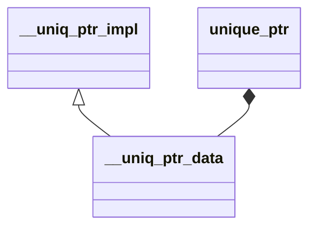

# 独占指针源码解析

> 当前文档为 GNU Standard C++ Library (libstdc++) 的独占指针的阅读笔记

## 相关头文件

- memory
- backward/auto_ptr.h
- bits/unique_ptr.h

## ~~auto_ptr~~（C++11及以上已废弃）

> 作用：主要用于自动管理资源的释放，例如在析构时自动释放资源

### 类结构

- auto_ptr_ref 主要用于存放指针
- auto_ptr 主要用于管理资源

### auto_ptr_ref 源码解析

```c++
template<typename _Tp1>
struct auto_ptr_ref
{
    _Tp1* _M_ptr;
    
    explicit
    auto_ptr_ref(_Tp1* __p): _M_ptr(__p) { }
} _GLIBCXX11_DEPRECATED;
```

### auto_ptr 源码解析

```c++
template<typename _Tp>
class auto_ptr
{
    private:
    _Tp* _M_ptr;
    
    public:
    typedef _Tp element_type;

    explicit auto_ptr(element_type* __p = 0) throw() : _M_ptr(__p) { }
    auto_ptr(auto_ptr& __a) throw() : _M_ptr(__a.release()) { }

    template<typename _Tp1>
    auto_ptr(auto_ptr<_Tp1>& __a) throw() : _M_ptr(__a.release()) { }

    auto_ptr& operator=(auto_ptr& __a) throw()
    {
        reset(__a.release());
        return *this;
    }

    template<typename _Tp1>
    auto_ptr& operator=(auto_ptr<_Tp1>& __a) throw()
    {
        reset(__a.release());
        return *this;
    }

    ~auto_ptr() { delete _M_ptr; } // 析构时释放资源
    
    element_type& operator*() const throw() 
    {
        __glibcxx_assert(_M_ptr != 0);
        return *_M_ptr; 
    }
    
    element_type* operator->() const throw() 
    {
        __glibcxx_assert(_M_ptr != 0);
        return _M_ptr; 
    }

    element_type* get() const throw() { return _M_ptr; }

    element_type* release() throw() // 返回旧元素指针，不做销毁
    {
        element_type* __tmp = _M_ptr;
        _M_ptr = 0;
        return __tmp;
    }

    void reset(element_type* __p = 0) throw()
    {
        if (__p != _M_ptr)
        {
            delete _M_ptr;
            _M_ptr = __p;
        }
    }
    
    // 通过 auto_ptr_ref 构造 auto_ptr
    auto_ptr(auto_ptr_ref<element_type> __ref) throw()
    : _M_ptr(__ref._M_ptr) { }
    
    auto_ptr& operator=(auto_ptr_ref<element_type> __ref) throw()
    {
        if (__ref._M_ptr != this->get())
        {
            delete _M_ptr;
            _M_ptr = __ref._M_ptr;
        }
        return *this;
    }
    
    template<typename _Tp1>
    operator auto_ptr_ref<_Tp1>() throw()
    { return auto_ptr_ref<_Tp1>(this->release()); }

    template<typename _Tp1>
    operator auto_ptr<_Tp1>() throw()
    { return auto_ptr<_Tp1>(this->release()); }
    } _GLIBCXX11_DEPRECATED_SUGGEST("std::unique_ptr");
```

### auto_ptr 的 void 特化版本

```c++
template<>
class auto_ptr<void>
{
public:
    typedef void element_type;
} _GLIBCXX11_DEPRECATED;
```

## unique_ptr（独占指针）

> 作用：管理资源的唯一所有权，并在析构时释放资源

### 类结构

- __uniq_ptr_impl 包含独占指针的数据
- __uniq_ptr_data 主要包含各种情况的构造，派生于 __uniq_ptr_impl
- unique_ptr 主要用于管理资源唯一所有权，包含 __uniq_ptr_data

#### 关系图如下



### __uniq_ptr_impl 通用模板源码解析

> 作用：主要用于存储指针数据和删除器对象

```c++
// _Tp 表示元素类型，_Dp 表示删除器类型
template <typename _Tp, typename _Dp>
class __uniq_ptr_impl
{
    // _Ptr 主模版
    template <typename _Up, typename _Ep, typename = void>
    struct _Ptr
    {
        using type = _Up*;
    };

    // _Ptr 偏特化版本，表示 _Ep 类型内部包含 pointer 类型，使用内部的 pointer 类型作为 _Ptr 的类型
    template <typename _Up, typename _Ep>
    struct _Ptr<_Up, _Ep, __void_t<typename remove_reference<_Ep>::type::pointer>>
    {
        using type = typename remove_reference<_Ep>::type::pointer;
    };

public:
    // 删除器的约束，表示 _Dp 不是一个指针且是默认构造的类型
    using _DeleterConstraint = enable_if<
    __and_<__not_<is_pointer<_Dp>>,
        is_default_constructible<_Dp>>::value>;

    using pointer = typename _Ptr<_Tp, _Dp>::type; // 获取指针类型

    static_assert( !is_rvalue_reference<_Dp>::value,
            "unique_ptr's deleter type must be a function object type"
            " or an lvalue reference type" );

    __uniq_ptr_impl() = default;
    _GLIBCXX23_CONSTEXPR
    __uniq_ptr_impl(pointer __p) : _M_t() { _M_ptr() = __p; }

    template<typename _Del>
    _GLIBCXX23_CONSTEXPR
    __uniq_ptr_impl(pointer __p, _Del&& __d)
    : _M_t(__p, std::forward<_Del>(__d)) { }

    _GLIBCXX23_CONSTEXPR
    __uniq_ptr_impl(__uniq_ptr_impl&& __u) noexcept // 移动构造函数
    : _M_t(std::move(__u._M_t))
    { __u._M_ptr() = nullptr; }

    _GLIBCXX23_CONSTEXPR
    __uniq_ptr_impl& operator=(__uniq_ptr_impl&& __u) noexcept // 移动赋值函数
    {
        reset(__u.release());
        _M_deleter() = std::forward<_Dp>(__u._M_deleter());
        return *this;
    }

    _GLIBCXX23_CONSTEXPR
    pointer&   _M_ptr() noexcept { return std::get<0>(_M_t); } // 获取到内部的指针
    _GLIBCXX23_CONSTEXPR
    pointer    _M_ptr() const noexcept { return std::get<0>(_M_t); }
    _GLIBCXX23_CONSTEXPR
    _Dp&       _M_deleter() noexcept { return std::get<1>(_M_t); } // 获取删除器
    _GLIBCXX23_CONSTEXPR
    const _Dp& _M_deleter() const noexcept { return std::get<1>(_M_t); }

    _GLIBCXX23_CONSTEXPR
    void reset(pointer __p) noexcept // 重置内部指针
    {
        const pointer __old_p = _M_ptr();
        _M_ptr() = __p;
        if (__old_p)
            _M_deleter()(__old_p);
    }

    _GLIBCXX23_CONSTEXPR
    pointer release() noexcept
    {
        pointer __p = _M_ptr();
        _M_ptr() = nullptr;
        return __p;
    }

    _GLIBCXX23_CONSTEXPR
    void
    swap(__uniq_ptr_impl& __rhs) noexcept
    {
        using std::swap;
        swap(this->_M_ptr(), __rhs._M_ptr());
        swap(this->_M_deleter(), __rhs._M_deleter());
    }

private:
    tuple<pointer, _Dp> _M_t; // 使用元组存储指针和删除器
};
```

### __uniq_ptr_data 源码解析

> 作用：主要针对 __uniq_ptr_impl 进行不同的构造函数和赋值函数约束

```c++
// 定义通用模板，根据特化版本，仅同时包含移动构造和移动赋值
template <typename _Tp, typename _Dp,
    bool = is_move_constructible<_Dp>::value,
    bool = is_move_assignable<_Dp>::value>
struct __uniq_ptr_data : __uniq_ptr_impl<_Tp, _Dp>
{
    using __uniq_ptr_impl<_Tp, _Dp>::__uniq_ptr_impl; // 使用基类构造函数
    __uniq_ptr_data(__uniq_ptr_data&&) = default;
    __uniq_ptr_data& operator=(__uniq_ptr_data&&) = default;
};

// 删除器不支持移动赋值，故删除移动赋值函数
template <typename _Tp, typename _Dp>
struct __uniq_ptr_data<_Tp, _Dp, true, false> : __uniq_ptr_impl<_Tp, _Dp>
{
    using __uniq_ptr_impl<_Tp, _Dp>::__uniq_ptr_impl;
    __uniq_ptr_data(__uniq_ptr_data&&) = default;
    __uniq_ptr_data& operator=(__uniq_ptr_data&&) = delete;
};

// 删除器不支持移动构造，故删除移动构造函数
template <typename _Tp, typename _Dp>
struct __uniq_ptr_data<_Tp, _Dp, false, true> : __uniq_ptr_impl<_Tp, _Dp>
{
    using __uniq_ptr_impl<_Tp, _Dp>::__uniq_ptr_impl;
    __uniq_ptr_data(__uniq_ptr_data&&) = delete;
    __uniq_ptr_data& operator=(__uniq_ptr_data&&) = default;
};

// 删除器不支持移动构造和移动赋值，故删除移动构造函数和移动赋值函数
template <typename _Tp, typename _Dp>
struct __uniq_ptr_data<_Tp, _Dp, false, false> : __uniq_ptr_impl<_Tp, _Dp>
{
    using __uniq_ptr_impl<_Tp, _Dp>::__uniq_ptr_impl;
    __uniq_ptr_data(__uniq_ptr_data&&) = delete;
    __uniq_ptr_data& operator=(__uniq_ptr_data&&) = delete;
};
```

### unique_ptr 源码解析

```c++
template <typename _Tp, typename _Dp = default_delete<_Tp>>
class unique_ptr
{
    template <typename _Up>
    using _DeleterConstraint =
        typename __uniq_ptr_impl<_Tp, _Up>::_DeleterConstraint::type;

    __uniq_ptr_data<_Tp, _Dp> _M_t; // 实际存储指针和删除器

public:
    using pointer	  = typename __uniq_ptr_impl<_Tp, _Dp>::pointer;
    using element_type  = _Tp;
    using deleter_type  = _Dp;

private:
    // 判断 pointer 是否可以向上转换为 unique_ptr<_Up, _Ep>::pointer，并且 _Up 不是数组
    template<typename _Up, typename _Ep>
    using __safe_conversion_up = __and_<
        is_convertible<typename unique_ptr<_Up, _Ep>::pointer, pointer>,
        __not_<is_array<_Up>>
        >;

public:
    template<typename _Del = _Dp, typename = _DeleterConstraint<_Del>>
    constexpr unique_ptr() noexcept : _M_t() { }

    template<typename _Del = _Dp, typename = _DeleterConstraint<_Del>>
    _GLIBCXX23_CONSTEXPR
    explicit unique_ptr(pointer __p) noexcept : _M_t(__p) { }

    // 删除器支持拷贝构造
    template<typename _Del = deleter_type, typename = _Require<is_copy_constructible<_Del>>>
    _GLIBCXX23_CONSTEXPR
    unique_ptr(pointer __p, const deleter_type& __d) noexcept : _M_t(__p, __d) { }

    // 删除器支持移动构造，且为右值
    template<typename _Del = deleter_type, typename = _Require<is_move_constructible<_Del>>>
    _GLIBCXX23_CONSTEXPR
    unique_ptr(pointer __p, __enable_if_t<!is_lvalue_reference<_Del>::value, _Del&&> __d) noexcept
    : _M_t(__p, std::move(__d)) { }

    // 删除器为左值引用，删除引用进行传入，不支持该构造函数
    template<typename _Del = deleter_type, typename _DelUnref = typename remove_reference<_Del>::type>
    _GLIBCXX23_CONSTEXPR
    unique_ptr(pointer, __enable_if_t<is_lvalue_reference<_Del>::value, _DelUnref&&>) = delete;

    // 空指针的 unique_ptr
    template<typename _Del = _Dp, typename = _DeleterConstraint<_Del>>
    constexpr unique_ptr(nullptr_t) noexcept : _M_t() { }

    unique_ptr(unique_ptr&&) = default;

    // 针对其他泛型类型的 unique_ptr 的拷贝构造
    // 1. _Up 和 _Ep 的 pointer 可转换
    // 2. 如果删除器是引用，则判断 _Ep 和 _Dp 是否相等；否则判断 _Ep 和 _Dp 是否可转换
    template<typename _Up, typename _Ep, typename = _Require<
        __safe_conversion_up<_Up, _Ep>, 
        __conditional_t<is_reference<_Dp>::value, is_same<_Ep, _Dp>, is_convertible<_Ep, _Dp>>>
    >
    _GLIBCXX23_CONSTEXPR
    unique_ptr(unique_ptr<_Up, _Ep>&& __u) noexcept
    : _M_t(__u.release(), std::forward<_Ep>(__u.get_deleter())) { }

#if __cplusplus > 202002L && __cpp_constexpr_dynamic_alloc
    constexpr
#endif
    ~unique_ptr() noexcept
    {
        static_assert(__is_invocable<deleter_type&, pointer>::value,
                    "unique_ptr's deleter must be invocable with a pointer");
        auto& __ptr = _M_t._M_ptr();
        if (__ptr != nullptr)
            get_deleter()(std::move(__ptr));
        __ptr = pointer();
    }

    unique_ptr& operator=(unique_ptr&&) = default;

    template<typename _Up, typename _Ep>
    _GLIBCXX23_CONSTEXPR
    typename enable_if<
        __and_<__safe_conversion_up<_Up, _Ep>, is_assignable<deleter_type&, _Ep&&>
    >::value, unique_ptr&>::type
    operator=(unique_ptr<_Up, _Ep>&& __u) noexcept
    {
        reset(__u.release());
        get_deleter() = std::forward<_Ep>(__u.get_deleter());
        return *this;
    }

    _GLIBCXX23_CONSTEXPR
    unique_ptr&
    operator=(nullptr_t) noexcept
    {
        reset();
        return *this;
    }

    _GLIBCXX23_CONSTEXPR
    typename add_lvalue_reference<element_type>::type
    operator*() const noexcept(noexcept(*std::declval<pointer>()))
    {
        __glibcxx_assert(get() != pointer());
        return *get();
    }

    _GLIBCXX23_CONSTEXPR
    pointer
    operator->() const noexcept
    {
        _GLIBCXX_DEBUG_PEDASSERT(get() != pointer());
        return get();
    }

    _GLIBCXX23_CONSTEXPR
    pointer get() const noexcept
    { return _M_t._M_ptr(); }

    _GLIBCXX23_CONSTEXPR
    deleter_type& get_deleter() noexcept
    { return _M_t._M_deleter(); }

    _GLIBCXX23_CONSTEXPR
    const deleter_type& get_deleter() const noexcept
    { return _M_t._M_deleter(); }

    _GLIBCXX23_CONSTEXPR
    explicit operator bool() const noexcept
    { return get() == pointer() ? false : true; }

    _GLIBCXX23_CONSTEXPR
    pointer release() noexcept
    { return _M_t.release(); }

    _GLIBCXX23_CONSTEXPR
    void reset(pointer __p = pointer()) noexcept
    {
        static_assert(__is_invocable<deleter_type&, pointer>::value,
                    "unique_ptr's deleter must be invocable with a pointer");
        _M_t.reset(std::move(__p));
    }

    _GLIBCXX23_CONSTEXPR
    void swap(unique_ptr& __u) noexcept
    {
        static_assert(__is_swappable<_Dp>::value, "deleter must be swappable");
        _M_t.swap(__u._M_t);
    }

    // 删除拷贝构造函数和拷贝赋值函数，不允许进行拷贝，仅支持移动
    unique_ptr(const unique_ptr&) = delete;
    unique_ptr& operator=(const unique_ptr&) = delete;
};
```

### unique_ptr 默认删除器源码解析

```c++
template<typename _Tp>
struct default_delete
{
    constexpr default_delete() noexcept = default;

    template<typename _Up, typename = _Require<is_convertible<_Up*, _Tp*>>>
    _GLIBCXX23_CONSTEXPR
    default_delete(const default_delete<_Up>&) noexcept { }

    _GLIBCXX23_CONSTEXPR
    void operator()(_Tp* __ptr) const
    {
        static_assert(!is_void<_Tp>::value,
                    "can't delete pointer to incomplete type");
        static_assert(sizeof(_Tp)>0,
                    "can't delete pointer to incomplete type");
        delete __ptr;
    }
};

template<typename _Tp>
struct default_delete<_Tp[]>
{
public:
    constexpr default_delete() noexcept = default;

    template<typename _Up, typename = _Require<is_convertible<_Up(*)[], _Tp(*)[]>>>
    _GLIBCXX23_CONSTEXPR
    default_delete(const default_delete<_Up[]>&) noexcept { }

    template<typename _Up>
    _GLIBCXX23_CONSTEXPR
    typename enable_if<is_convertible<_Up(*)[], _Tp(*)[]>::value>::type
    operator()(_Up* __ptr) const
    {
        static_assert(sizeof(_Tp)>0,
            "can't delete pointer to incomplete type");
        delete [] __ptr;
    }
};
```

## 常见面试题

### **1. 基础概念**
**Q: 说说 `std::unique_ptr` 是什么？它的核心思想是什么？**
**A:**
`std::unique_ptr` 是 C++11 引入的智能指针，用于管理动态分配对象的生命周期。它的核心思想是 **独占所有权（Exclusive Ownership）**。
-   这意味着**一个 `unique_ptr` 在任何时刻都唯一地拥有其指向的对象**。
-   它通过禁止拷贝操作（拷贝构造和拷贝赋值运算符被 `= delete`）来强制执行这一规则，从而避免了多个指针管理同一份资源可能带来的重复释放问题。
-   当 `unique_ptr` 被销毁（例如离开作用域）时，它所管理的对象会被自动销毁，内存会被自动释放，完美体现了 RAII (Resource Acquisition Is Initialization) 理念。

---

### **2. 所有权转移**
**Q: 既然 `unique_ptr` 不能拷贝，如何实现所有权的转移？**
**A:**
虽然禁止拷贝，但 `unique_ptr` **支持移动语义（Move Semantics）**。
-   我们可以使用 `std::move()` 将其所有权转移给另一个 `unique_ptr`。
-   转移后，**源 `unique_ptr` 会变为 `nullptr`**，不再拥有任何资源，而目标 `unique_ptr` 则接管了资源的所有权。
-   这个过程通常发生在函数返回值、将 `unique_ptr` 放入容器、或者显式地赋值给另一个 `unique_ptr` 时。

**示例：**
```cpp
std::unique_ptr<MyClass> ptr1(new MyClass);
// std::unique_ptr<MyClass> ptr2 = ptr1; // 错误！不能拷贝
std::unique_ptr<MyClass> ptr2 = std::move(ptr1); // 正确！所有权转移
// 现在 ptr1.get() == nullptr, ptr2 拥有对象
```

---

### **3. 与 `shared_ptr` 和 `auto_ptr` 的比较**
**Q: `unique_ptr` 和 `shared_ptr` 最主要的区别是什么？**
**A:**
最根本的区别在于所有权的模型：
-   **`unique_ptr`**：**独占所有权**。一个对象只能被一个 `unique_ptr` 拥有。开销小，效率高（几乎等同于裸指针）。
-   **`shared_ptr`**：**共享所有权**。通过引用计数机制，多个 `shared_ptr` 可以“共享”同一个对象的所有权。当最后一个 `shared_ptr` 被销毁时，对象才会被释放。因为有引用计数的开销，所以比 `unique_ptr` 稍慢且占用更多内存。

**Q: 为什么 `auto_ptr` 被废弃，而用 `unique_ptr` 替代？**
**A:**
`auto_ptr` 在 C++98 中引入，试图实现独占所有权，但其设计有严重缺陷：
-   **危险的拷贝语义**：`auto_ptr` 的拷贝操作会默默地转移所有权，这极易导致意想不到的行为和难以调试的 bug。例如，将 `auto_ptr` 传入函数或放入标准容器都会导致所有权转移，使源指针失效。
-   **`unique_ptr` 的改进**：`unique_ptr` 通过在**编译期**直接禁止拷贝操作，强制使用者必须显式使用 `std::move` 来转移所有权，这使得所有权的转移变得清晰、明确，避免了 `auto_ptr` 的潜在陷阱。因此，`unique_ptr` 更安全、更符合直觉。

---

### **4. 源码实现原理**
**Q: `unique_ptr` 是如何实现禁止拷贝和允许移动的？**
**A:**
（这是一个考察深度的好问题）
-   **禁止拷贝**：在其类定义中，显式地将拷贝构造函数和拷贝赋值运算符标记为 `= delete`。这使得任何尝试拷贝的行为都会导致编译错误。
    ```cpp
    unique_ptr(const unique_ptr&) = delete;
    unique_ptr& operator=(const unique_ptr&) = delete;
    ```
-   **允许移动**：它实现了移动构造函数和移动赋值运算符。这些函数接受右值引用参数，并通过 `noexcept` 关键字声明保证不会抛出异常，这对于标准容器等组件的异常安全至关重要。在这些函数内部，通常通过交换（`swap`）内部管理的裸指针来实现所有权的转移。
    ```cpp
    unique_ptr(unique_ptr&& other) noexcept; // 移动构造
    unique_ptr& operator=(unique_ptr&& other) noexcept; // 移动赋值
    ```

---

### **5. 使用场景与陷阱**
**Q: 什么情况下应该使用 `unique_ptr`？**
**A:**
-   **工厂模式**：工厂函数返回 `unique_ptr`，明确地将对象的所有权转移给调用者。
-   **替代裸指针**：在任何需要使用 `new`/`delete` 管理单个对象生命周期的地方，都应优先使用 `unique_ptr`，以确保异常安全。
-   **作为类的成员变量**：当某个类独占另一个对象时，可以使用 `unique_ptr` 作为成员，这样类的析构函数会自动销毁该成员管理的对象。
-   **管理资源**：配合自定义删除器，管理文件句柄 (`fclose`)、套接字 (`closesocket`) 等任何需要释放的资源。

**Q: 使用 `unique_ptr` 时有什么需要特别注意的陷阱？**
**A:**
-   **`get()` 的误用**：`get()` 返回的裸指针**没有所有权**。绝对不要用它来创建另一个智能指针，或者手动 `delete` 它，这会导致重复释放。
-   **悬空指针**：使用 `std::move` 转移所有权后，忘记源指针已变为 `nullptr`，继续使用它会导致未定义行为。

---

### **6. 高级特性**
**Q: `unique_ptr` 如何管理动态数组？**
**A:**
-   通过使用**部分特化版本** `std::unique_ptr<T[]>`。
-   这个特化版本会在析构时调用 `delete[]` 而不是 `delete`，从而正确释放数组内存。
-   它还提供了 `operator[]`，允许像普通数组一样通过索引访问元素。
    ```cpp
    std::unique_ptr<int[]> array_ptr(new int[10]);
    array_ptr[0] = 42; // 正确
    ```

**Q: 什么是自定义删除器（Deleter）？什么时候需要它？**
**A:**
-   默认情况下，`unique_ptr` 使用 `delete` 或 `delete[]` 来释放资源。**自定义删除器**允许我们指定一个自定义的函数或可调用对象来释放资源。
-   **使用场景**：当管理的资源不是通过 `new` 分配的内存时。例如：
    -   管理使用 `malloc` 分配的内存（删除器用 `std::free`）。
    -   管理文件句柄 `FILE*`（删除器用 `fclose`）。
    -   管理操作系统特有的资源，如窗口句柄、线程句柄等。

**示例（使用 Lambda 作为删除器）：**
```cpp
auto file_deleter = [](FILE* fp) { if(fp) fclose(fp); };
std::unique_ptr<FILE, decltype(file_deleter)> file_ptr(fopen("data.txt", "r"), file_deleter);
```
